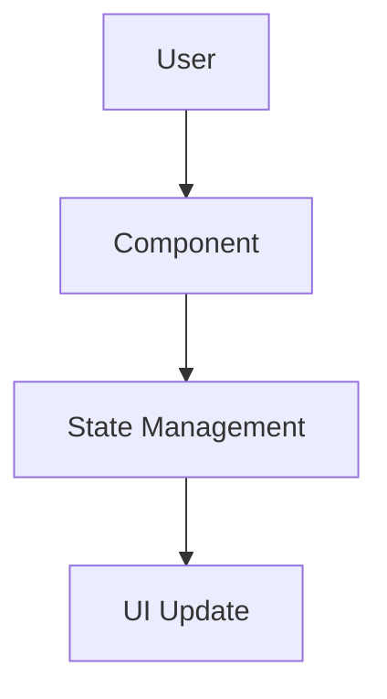
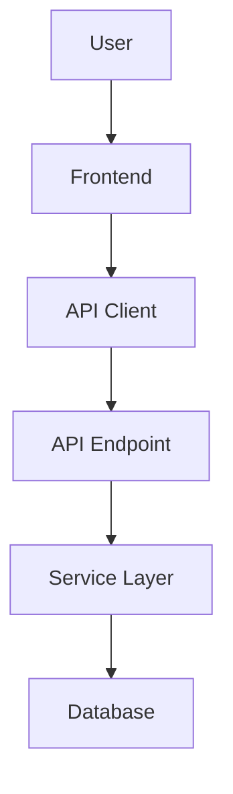
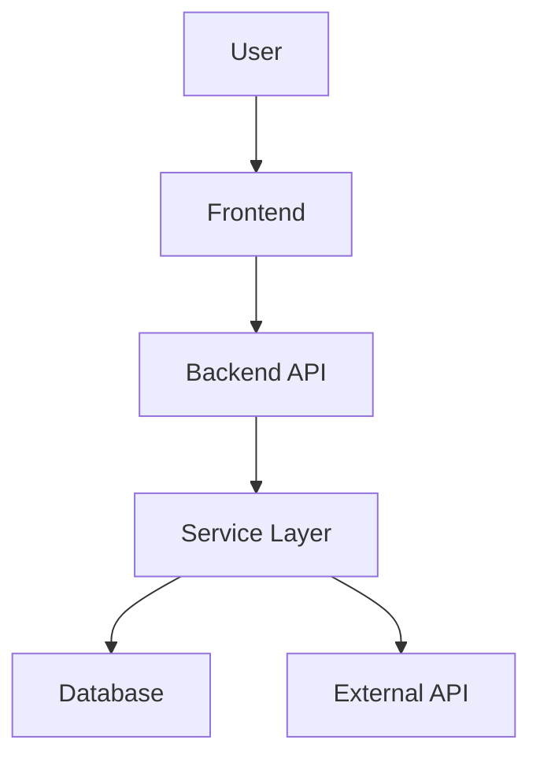

## Document Overview

Each feature produces TWO files in a subfolder:

| File | Purpose | Content Focus |
|------|---------|---------------|
| `spec.md` | Technical specification | Architecture, API contracts, data models, testing strategy |
| `plan.md` | Implementation roadmap | Phases, numbered steps with high-level descriptions |

---

## Complexity Levels

Classify features before generating documents:

| Complexity | Criteria |
|------------|----------|
| `trivial` | Single component, no API changes, no DB changes, no integrations |
| `simple` | Few components, 1-10 endpoints, slight DB schema changes, no integrations |
| `medium` | Multiple components, 11-30 endpoints, regular DB schema changes, basic integrations |
| `complex` | Multiple layers, 30+ endpoints, complex DB migrations, external services |

**Depth scaling by complexity:**

| Section | trivial | simple | medium | complex |
|---------|---------|--------|--------|---------|
| 1. Overview | 2-3 paragraphs | 2-3 paragraphs | 3-4 paragraphs | 4-5 paragraphs |
| 2. Architecture | 1-2 components | 2-4 components | 4-8 components | 8+ components |
| 3. Decisions | 1 decision | 1-2 decisions | 2-4 decisions | 4-6 decisions |
| 4. Components | 2-4 files | 4-6 files | 6-10 files | 10+ files |
| 5. API Contracts | Skip | 1-2 endpoints | 3-5 endpoints | 5+ endpoints |
| 6. Data Model | Skip | Basic schema | Full schema + indexes | Full schema + migration |
| 7. Testing | Basic tests | Test files + functions | Comprehensive | Full test matrix |

**Plan document scaling:**

| Complexity | Phases | Steps | Description Detail |
|------------|--------|-------|-------------------|
| trivial | 1 | 1 | High-level (1-2 sentences) |
| simple | 2 | 3 | High-level (1-3 sentences) |
| medium | 3-4 | 4-5 | High-level (1-3 sentences) |
| complex | 5-7 | 5-10 | High-level (1-3 sentences) |

---

## SPEC Document Structure (7 Sections)

### Section 1: Technical Overview

**Content:**
- **What:** Brief description of what will be implemented
- **Why:** Technical motivation (not business justification)
- **Scope:** What's included vs excluded

### Section 2: Architecture Impact

**Content:**
- Affected components list with file paths
- Mermaid diagram showing components and data flow

**Mermaid label quoting rule (must follow):**

Wrap any node label in double quotes when it contains shape-delimiter or edge characters: `/`, `\`, `(`, `)`, `[`, `]`, `{`, `}`, `|`, or `"`. Otherwise the Mermaid parser treats them as shape modifiers and breaks the diagram.

- Wrong: `A[/login page]` — the leading `/` opens a trapezoid shape that never closes
- Right: `A["/login page"]`
- Wrong: `B[src/app/page.tsx (RSC)]` — slash plus parentheses inside the label
- Right: `B["src/app/page.tsx (RSC)"]`
- Plain ASCII identifiers are fine unquoted: `[SiteHeader]`, `[Hero]`, `[Database]`

Rule of thumb: if a label contains a path, a type annotation, a parenthetical clarifier, or any punctuation beyond spaces and hyphens, quote it.

**Diagram patterns:**

Frontend-only:


Fullstack:


With external services:


### Section 3: Technical Decisions

**Format:**

| Decision | Chosen Approach | Alternative Considered | Trade-off |
|----------|----------------|----------------------|-----------|
| [Decision] | [Choice] | [Alternative] | [What we accept] |

### Section 4: Component Overview

**Tables by layer:**

**Frontend:**

| File Path | New/Modified | Purpose | Key Responsibilities |
|-----------|--------------|---------|---------------------|
| `src/components/Feature.tsx` | New | Purpose | 2-3 responsibilities |

**Backend:**

| File Path | New/Modified | Purpose | Key Responsibilities |
|-----------|--------------|---------|---------------------|
| `app/services/feature.py` | New | Business logic | 2-3 responsibilities |

**Database:**

| Migration File | Tables Affected | Operation | Notes |
|----------------|-----------------|-----------|-------|
| `YYYYMMDD_create_table.sql` | `table_name` | CREATE | Purpose |

### Section 5: API Contracts

**For each endpoint include:**

- Method, Path, Authentication
- Request table with: Field, Type, Required, Validation, Description
- Request JSON example
- Response table with: Field, Type, Description
- Response JSON example
- Error codes table with: Code, HTTP Status, Description

**Example:**

**Endpoint: Record Token Usage**
- **Method:** POST
- **Path:** `/api/v1/analytics/token-usage`
- **Authentication:** JWT Bearer

**Request:**

| Field | Type | Required | Validation | Description |
|-------|------|----------|------------|-------------|
| `video_id` | `uuid` | Yes | valid UUID | Reference to video |
| `service` | `string` | Yes | enum: openai, anthropic | AI provider |
| `tokens_input` | `integer` | Yes | min: 0 | Input tokens |

**Request Example:**
```json
{
  "video_id": "550e8400-e29b-41d4-a716-446655440000",
  "service": "openai",
  "tokens_input": 1500
}
```

**Response (Success - 201):**

| Field | Type | Description |
|-------|------|-------------|
| `status` | `string` | Always "success" |
| `data.id` | `uuid` | Created record ID |
| `data.video_id` | `uuid` | Video reference |
| `data.tokens_total` | `integer` | Computed total tokens |
| `data.cost_usd` | `decimal` | Calculated cost |

**Response Example:**
```json
{
  "status": "success",
  "data": {
    "id": "660e8400-e29b-41d4-a716-446655440001",
    "video_id": "550e8400-e29b-41d4-a716-446655440000",
    "service": "openai",
    "tokens_input": 1500,
    "tokens_total": 1500,
    "cost_usd": 0.0045
  }
}
```

**Error Codes:**

| Code | HTTP Status | Description |
|------|-------------|-------------|
| `TOKEN001` | 400 | Invalid service provider |
| `TOKEN002` | 404 | Video not found |

### Section 6: Data Model

**For each table include:**

**Table: `table_name`**

| Column | Type | Nullable | Default | Description |
|--------|------|----------|---------|-------------|
| `id` | `uuid` | No | `gen_random_uuid()` | Primary key |
| `field` | `varchar(255)` | No | - | Description |

**Indexes:**

| Index Name | Columns | Type | Purpose |
|------------|---------|------|---------|
| `ix_table_field` | `field` | btree | Query optimization |

**Constraints:**

| Constraint | Type | Definition | Purpose |
|------------|------|------------|---------|
| `pk_table` | PRIMARY KEY | `id` | Unique identifier |
| `fk_table_ref` | FOREIGN KEY | `ref_id REFERENCES other(id)` | Referential integrity |

**Cross-Database Notes:**
- Use `uuid` with GUID helper for PostgreSQL/SQLite compatibility
- Use `decimal(10,4)` instead of `money` type
- Use `varchar(N)` enum pattern instead of native ENUM for SQLite
- Use `timestamptz` (PostgreSQL) with fallback to `datetime` (SQLite)

**Migration Example:**
```sql
CREATE TABLE table_name (
    id UUID PRIMARY KEY DEFAULT gen_random_uuid(),
    field VARCHAR(255) NOT NULL,
    created_at TIMESTAMPTZ NOT NULL DEFAULT NOW()
);

CREATE INDEX ix_table_field ON table_name(field);
```

### Section 7: Testing Strategy

**Test File Structure:**

| Test File | Test Type | Target | Coverage Goal |
|-----------|-----------|--------|---------------|
| `tests/unit/test_service.py` | Unit | `service` | 90% |
| `tests/integration/test_api.py` | Integration | API endpoints | 80% |

**For each test file, list functions:**

| Test Function | Description | Assertions |
|---------------|-------------|------------|
| `test_create_success` | Valid creation | Returns object, DB record exists |
| `test_create_invalid` | Validation failure | Raises ValidationError |

---

## PLAN Document Structure

### Header

```markdown
# Implementation Plan: [Feature Name]

**Prerequisites:**
- Tools/libraries with versions
- Environment variables
- Configuration files
```

### Phases and Steps

**Format:**
```markdown
### Stage N: [Phase Name]

**1. Component Name** - High-level description of what needs to be done. Reference the spec for technical details.

**2. Next Component** - Another high-level description...
```

**Numbering:** Continuous across all phases (1, 2, 3, 4...)

**Step description requirements:**
- 1-3 sentences describing WHAT needs to be done
- Focus on the outcome, not implementation details
- Reference the spec for technical details
- The spec contains all technical details; the plan guides execution order

**Avoid in step descriptions:**
- Specific data types, column names, method signatures
- Validation rules, constraints, cascade behaviors
- Code snippets or pseudo-code
- Testing references

---

## Content Guidelines

### SPEC Document - DO:

1. Include complete file paths with responsibilities
2. Include detailed JSON request/response examples
3. Include field types, validation rules, error codes
4. Include complete table schemas with indexes, constraints
5. Include SQL migration examples
6. Include specific test file names and functions
7. Use Mermaid diagrams for architecture
8. Present trade-offs for decisions
9. Reference existing patterns: "Follow X pattern from feature Y"

### SPEC Document - DON'T:

1. Include actual code implementation
2. Include step-by-step instructions
3. Repeat product requirements from PRD
4. Include time estimates
5. Add user stories or business justification

### PLAN Document - DO:

1. Use numbered list across all phases
2. Format: **Number. Component Name** - High-level paragraph
3. Describe WHAT needs to be done (1-3 sentences)
4. Reference spec for technical details
5. Group into phases

### PLAN Document - DON'T:

1. Include code snippets or pseudo-code
2. Include implementation details (data types, columns, methods)
3. Add testing sections within steps
4. Mention test files or implementation
5. Repeat architecture decisions from spec
6. Add time estimates
7. Use bullet points within steps
8. Include priority levels

---

## Examples

### Correct Plan Step (High-Level)

```markdown
**1. Token Usage Model and Migration** - Create the database model and migration for tracking API token usage per video. Set up relationships to users and videos with appropriate indexes for query performance.
```

### Wrong Plan Step (Too Detailed)

```markdown
**1. Token Usage Model and Migration** - Create the SQLAlchemy model for the `token_usage` table with fields including `user_id` (uuid, FK to users, ON DELETE CASCADE), `video_id` (uuid, FK to videos), `service` (varchar(50), enum: openai/anthropic/google)...
```

### Wrong Plan Step (Too Vague)

```markdown
**1. Token Usage Model** - Create a model to track token usage with the necessary fields.
```