# Vinho Notas — Arquitetura de Backend v2.0

> **Contexto:** O MVP original (2024) utilizou Java 17, Spring Boot, arquitetura em camadas
> (MVC) e comunicação exclusivamente síncrona via HTTP. A versão 2.0 evolui para **Java 21**,
> **Clean Architecture**, **Spring Cloud Gateway incorporado ao BFF**, **mensageria assíncrona
> com RabbitMQ**, **Saga Pattern por coreografia** e **Docker** como estratégia de
> containerização — tudo alinhado aos princípios do **The Twelve-Factor App**.

---

## 1. Visão Geral da Arquitetura

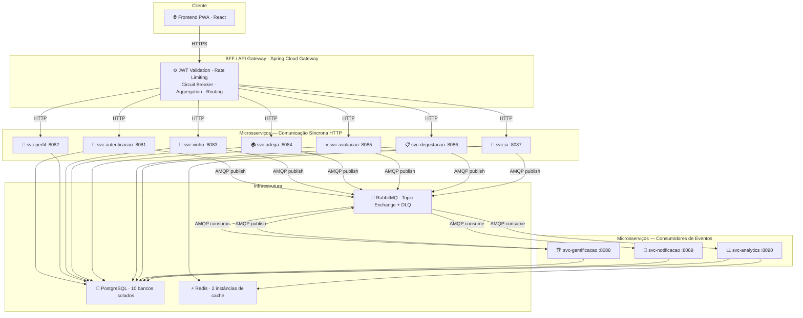

### Princípios fundamentais

- **Isolamento total:** cada microsserviço possui seu próprio banco de dados — sem acesso cruzado.
- **Dois canais de comunicação:** HTTP síncrono para respostas imediatas; RabbitMQ assíncrono para efeitos colaterais entre serviços.
- **Resiliência por design:** se `svc-analytics` ou `svc-gamificacao` caírem, o usuário continua cadastrando vinhos e avaliando normalmente. Os eventos ficam enfileirados e são processados quando os serviços voltam.
- **Clean Architecture:** nenhuma camada de domínio conhece frameworks — Spring Boot é detalhe de infraestrutura.
- **Twelve-Factor App:** configuração por variáveis de ambiente, processos stateless, backing services como recursos anexados, logs como streams.

---

## 2. Stack Tecnológica

| Camada | Tecnologia | Versão | Justificativa |
|---|---|---|---|
| Linguagem | Java | **21 LTS** | Virtual Threads, Records, Sealed Classes, Pattern Matching |
| Framework principal | Spring Boot | **3.3.x** | Spring AI, Problem Details RFC 7807, Testcontainers integrado |
| API Gateway / BFF | Spring Cloud Gateway | **4.1.x** | Reativo (WebFlux), filtros globais, circuit breaker nativo |
| Build | Maven | **3.9.x** | Multi-módulo com parent POM centralizado |
| Persistência | Spring Data JPA + Hibernate | 6.x | Compatível com Java 21 e Virtual Threads |
| Banco de dados | PostgreSQL | **16** | JSONB, UUID nativo, ACID, Flyway compatível |
| Migrações de banco | Flyway | **10.x** | Versionamento de schema, rollback controlado |
| Mensageria | RabbitMQ | **3.13** | Topic Exchange, DLQ, confirmação de entrega |
| Cliente RabbitMQ | Spring AMQP | 3.x | `@RabbitListener`, `RabbitTemplate`, ack manual configurável |
| Cache / Estado efêmero | Redis | **7.2** | Chat context TTL, dashboard snapshot cache |
| IA generativa | Spring AI | **1.0** | `ChatClient` — abstração de LLM (OpenAI / Anthropic) |
| Resiliência | Resilience4j | **2.x** | Circuit breaker, retry, timeout, rate limiter |
| Documentação de API | SpringDoc OpenAPI 3 | **2.x** | Swagger UI automático por serviço |
| Observabilidade | Micrometer + Actuator | 3.x | Métricas Prometheus, health checks |
| Rastreamento distribuído | Micrometer Tracing (Brave) | 3.x | `traceId` propagado entre todos os serviços |
| Logs estruturados | Logback + Logstash Encoder | — | JSON no stdout, pronto para ELK / CloudWatch |
| Containerização | Docker + Docker Compose | — | Multi-stage build, Spring Boot auto-detection |
| Testes de integração | Testcontainers | **1.19.x** | PostgreSQL e RabbitMQ reais nos testes |
| Testes de API | REST Assured | **5.x** | Contratos de API por microsserviço |
| Cobertura | JaCoCo | — | Mínimo 80% — configurado no parent POM |
| Qualidade de testes | PIT (Pitest) | — | Mutation testing — mede eficácia real dos testes |
| Segurança | Spring Security + JWT | 6.x | Stateless, validado no BFF antes dos serviços downstream |
| HTTP declarativo (BFF) | `@HttpExchange` | nativo Spring 6 | Substitui Feign — zero dependência externa |

---

## 3. Maven Multi-módulo

O repositório é um **mono-repo com Maven multi-módulo**. Um único `pom.xml` pai gerencia
todas as versões de dependência e plugins, garantindo consistência entre os 10 serviços.

### Estrutura do repositório

```
vinho-notas-backend/
│
├── pom.xml                          ← Parent POM (dependencyManagement)
│
├── shared-lib/                      ← Módulo compartilhado por todos os serviços
│   └── src/main/java/.../shared/
│       ├── result/      ← Result<T>, Success, Failure (sealed classes Java 21)
│       ├── exception/   ← DomainException, NotFoundException, ErrorCode
│       ├── event/       ← DTOs de eventos RabbitMQ (records imutáveis)
│       ├── security/    ← Utilitários JWT
│       └── test/        ← Helpers e factories compartilhados nos testes
│
├── bff/
├── svc-autenticacao/
├── svc-perfil/
├── svc-vinho/
├── svc-adega/
├── svc-avaliacao/
├── svc-degustacao/
├── svc-ia/
├── svc-gamificacao/
├── svc-notificacao/
└── svc-analytics/
```

### shared-lib — tipos fundamentais compartilhados

```java
// Result<T> — retorno explícito dos casos de uso (Java 21 sealed + records)
public sealed interface Result<T>
        permits Result.Success, Result.Failure {

    record Success<T>(T value)                       implements Result<T> {}
    record Failure<T>(String message, ErrorCode code) implements Result<T> {}

    static <T> Result<T> success(T value)         { return new Success<>(value); }
    static <T> Result<T> failure(String msg,
                                  ErrorCode code) { return new Failure<>(msg, code); }
    default boolean isSuccess() { return this instanceof Success<T>; }
}

// ErrorCode — enum compartilhado entre todos os serviços
public enum ErrorCode {
    NOT_FOUND, VALIDATION_ERROR, UNAUTHORIZED,
    CONFLICT, EXTERNAL_SERVICE_ERROR, BUSINESS_RULE_VIOLATION
}

// Exceção base de domínio
public class DomainException extends RuntimeException {
    private final ErrorCode errorCode;
    public DomainException(String message, ErrorCode errorCode) {
        super(message);
        this.errorCode = errorCode;
    }
}
```

---

## 4. Clean Architecture

### A regra de dependência

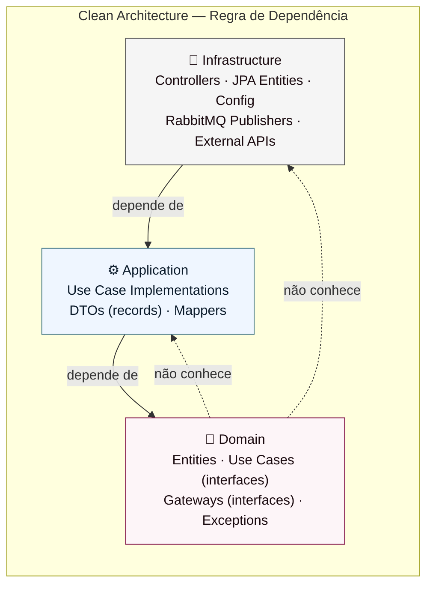

A camada `domain` é **Java puro** — sem anotações de Spring, JPA, Jackson ou qualquer
framework. Testável com JUnit sem carregar contexto de aplicação.

### Estrutura de pacotes — exemplo `svc-vinho`

```
com.vinhonotas.vinho/
│
├── domain/
│   ├── entities/
│   │   └── Vinho.java                    ← entidade de domínio pura
│   ├── usecases/
│   │   ├── CadastrarVinhoUseCase.java    ← porta de entrada (interface)
│   │   ├── ConsultarVinhosUseCase.java
│   │   └── EscanearRotuloUseCase.java
│   ├── gateways/
│   │   ├── VinhoGateway.java             ← porta de saída — repositório
│   │   ├── ScanRotuloGateway.java        ← porta de saída — API externa
│   │   └── EventPublisherGateway.java    ← porta de saída — mensageria
│   └── exceptions/
│       └── VinhoNaoEncontradoException.java
│
├── application/
│   ├── usecases/
│   │   └── CadastrarVinhoUseCaseImpl.java
│   ├── dtos/
│   │   ├── CadastrarVinhoCommand.java    ← record imutável (entrada)
│   │   ├── VinhoResponse.java            ← record imutável (saída)
│   │   └── FiltroVinhoQuery.java         ← record (parâmetros de busca)
│   └── mappers/
│       └── VinhoMapper.java              ← MapStruct: domínio ↔ DTO ↔ JPA
│
└── infrastructure/
    ├── persistence/
    │   ├── entities/    VinhoJpaEntity.java       ← @Entity com anotações JPA
    │   ├── repositories/ VinhoJpaRepository.java  ← Spring Data JPA
    │   └── gateways/    VinhoGatewayImpl.java     ← implementa VinhoGateway
    ├── web/
    │   ├── controllers/ VinhoController.java      ← @RestController
    │   └── handlers/    GlobalExceptionHandler.java ← Problem Details RFC 7807
    ├── messaging/
    │   └── VinhoEventPublisher.java               ← implementa EventPublisherGateway
    ├── external/
    │   └── ScanRotuloGatewayImpl.java             ← implementa ScanRotuloGateway
    └── config/
        ├── SecurityConfig.java
        ├── RabbitMQConfig.java
        └── FlywayConfig.java
```

### Exemplos com Java 21

**Entidade de domínio — zero framework:**
```java
public class Vinho {
    private final UUID   id;
    private       String rotulo;
    private       String pais;
    private       Integer safra;
    private final UUID   usuarioId;

    public void validarCamposObrigatorios() {
        if (rotulo == null || rotulo.isBlank())
            throw new DomainException("Rótulo é obrigatório",
                                       ErrorCode.VALIDATION_ERROR);
    }
}
```

**Command record — DTO de entrada imutável:**
```java
public record CadastrarVinhoCommand(
    @NotBlank  String     rotulo,
               String     pais,
               Integer    safra,
               String     tipo,
    @Positive  BigDecimal preco,
               String     codigoBarras
) {}
```

**Implementação do caso de uso — Outbox Pattern integrado:**
```java
@Component
@RequiredArgsConstructor
public class CadastrarVinhoUseCaseImpl implements CadastrarVinhoUseCase {

    private final VinhoGateway         vinhoGateway;
    private final EventPublisherGateway eventPublisher;
    private final VinhoMapper           mapper;

    @Override
    @Transactional
    public Result<VinhoResponse> executar(CadastrarVinhoCommand cmd, UUID usuarioId) {
        var vinho = mapper.toDomain(cmd, usuarioId);
        vinho.validarCamposObrigatorios();

        var salvo = vinhoGateway.salvar(vinho);

        // Outbox Pattern: evento registrado na mesma transação do INSERT
        eventPublisher.publicar(new VinhoCadastradoEvent(
            salvo.getId(), usuarioId, salvo.getRotulo()
        ));

        return Result.success(mapper.toResponse(salvo));
    }
}
```

**Controller com pattern matching em sealed Result (Java 21):**
```java
@PostMapping
public ResponseEntity<?> cadastrar(@Valid @RequestBody CadastrarVinhoCommand cmd,
                                    @RequestHeader("X-Usuario-Id") UUID usuarioId) {
    return switch (cadastrarVinho.executar(cmd, usuarioId)) {
        case Result.Success<VinhoResponse> s ->
            ResponseEntity.status(CREATED).body(s.value());
        case Result.Failure<VinhoResponse> f ->
            ResponseEntity.status(mapToStatus(f.code()))
                          .body(Problem.of(f.message()));
    };
}
```

---

## 5. BFF / API Gateway

O BFF é construído sobre o **Spring Cloud Gateway** (reativo, WebFlux + Netty).
É o único ponto de entrada do frontend e acumula as responsabilidades de gateway de
borda e orquestrador de respostas agregadas.

### Cadeia de responsabilidades

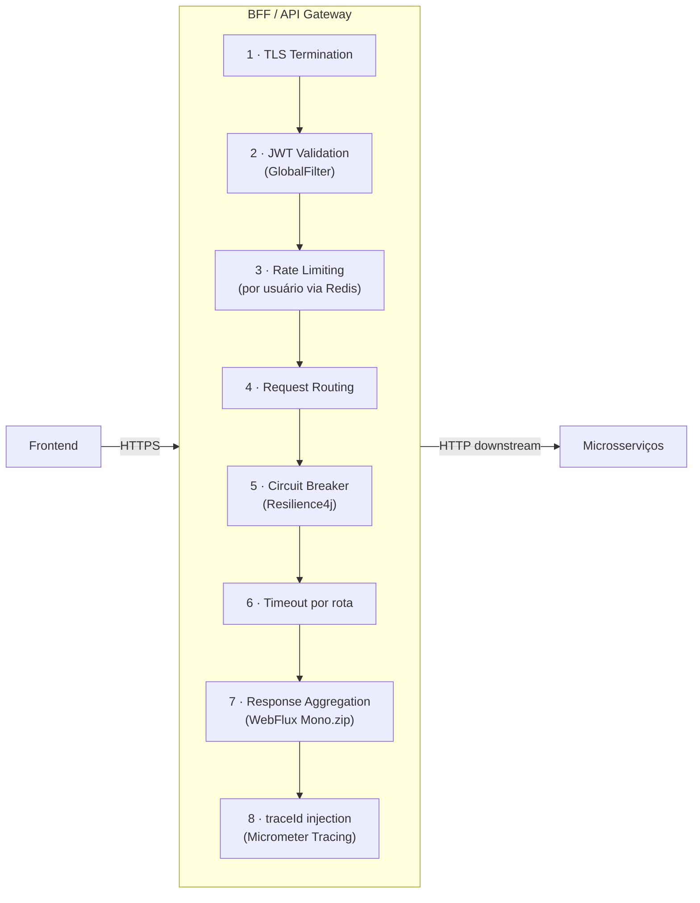

### Configuração de rotas — `application.yml`

```yaml
spring:
  cloud:
    gateway:
      routes:
        - id: svc-autenticacao
          uri: http://svc-autenticacao:8081
          predicates: [Path=/api/auth/**]
          filters:  [StripPrefix=1]

        - id: svc-vinho
          uri: http://svc-vinho:8083
          predicates: [Path=/api/vinhos/**]
          filters:
            - StripPrefix=1
            - name: CircuitBreaker
              args:
                name: svc-vinho-cb
                fallbackUri: forward:/fallback/vinho
            - name: RequestRateLimiter
              args:
                redis-rate-limiter.replenishRate: 20
                redis-rate-limiter.burstCapacity: 40
```

### Filtro global — validação JWT e propagação de identidade

```java
@Component
public class JwtAuthenticationFilter implements GlobalFilter, Ordered {

    private final JwtValidator jwtValidator;

    @Override
    public Mono<Void> filter(ServerWebExchange exchange, GatewayFilterChain chain) {
        var token = extractBearerToken(exchange.getRequest());

        if (token == null || !jwtValidator.isValid(token)) {
            exchange.getResponse().setStatusCode(HttpStatus.UNAUTHORIZED);
            return exchange.getResponse().setComplete();
        }

        // Propaga o usuarioId como header para todos os serviços downstream
        var usuarioId = jwtValidator.extractUsuarioId(token);
        var mutated   = exchange.getRequest().mutate()
                                .header("X-Usuario-Id", usuarioId.toString())
                                .build();
        return chain.filter(exchange.mutate().request(mutated).build());
    }

    @Override public int getOrder() { return -1; } // Executa antes de todos os filtros
}
```

### Agregação reativa — Dashboard (4 serviços em paralelo)

```java
@GetMapping("/api/dashboard")
public Mono<DashboardResponse> getDashboard(
        @RequestHeader("X-Usuario-Id") UUID usuarioId) {

    return Mono.zip(
        analyticsClient.getSnapshot(usuarioId),    // svc-analytics
        gamificacaoClient.getProgresso(usuarioId), // svc-gamificacao
        avaliacaoClient.getUltimas(usuarioId),     // svc-avaliacao
        adegaClient.getAlertas(usuarioId)          // svc-adega
    ).map(t -> DashboardResponse.of(
        t.getT1(), t.getT2(), t.getT3(), t.getT4()
    ));
    // As 4 chamadas ocorrem em paralelo — sem bloquear threads
}
```

### Resilience4j no BFF

```yaml
resilience4j:
  circuitbreaker:
    instances:
      svc-vinho-cb:
        slidingWindowSize: 10
        failureRateThreshold: 50
        waitDurationInOpenState: 10s
      svc-ia-cb:
        slidingWindowSize: 5
        failureRateThreshold: 60
        waitDurationInOpenState: 30s   # IA demora mais para recuperar

  timelimiter:
    instances:
      svc-ia-cb:   { timeoutDuration: 30s }
      default:     { timeoutDuration:  5s }
```

---

## 6. Comunicação entre Serviços — Dois Canais

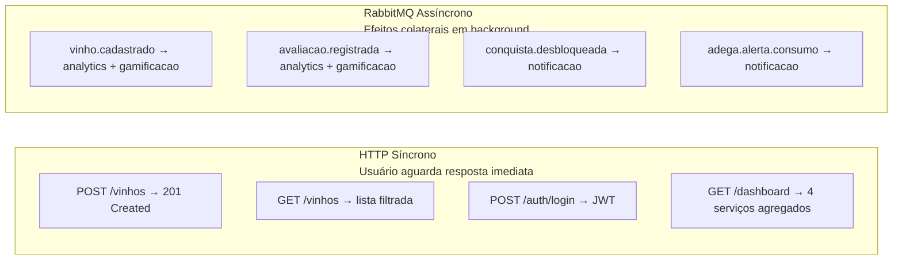

| Critério | HTTP Síncrono | RabbitMQ Assíncrono |
|---|---|---|
| Usuário aguarda resposta? | ✅ Sim | ❌ Não |
| Falha do consumidor bloqueia a ação principal? | Não tolerado | ✅ Tolerado |
| Múltiplos serviços interessados no mesmo evento? | ❌ Ineficiente | ✅ Pub/Sub natural |
| Garante entrega se serviço estiver fora? | ❌ Não | ✅ Fila durável |

---

## 7. RabbitMQ — Topologia Completa

### Exchanges, filas e bindings

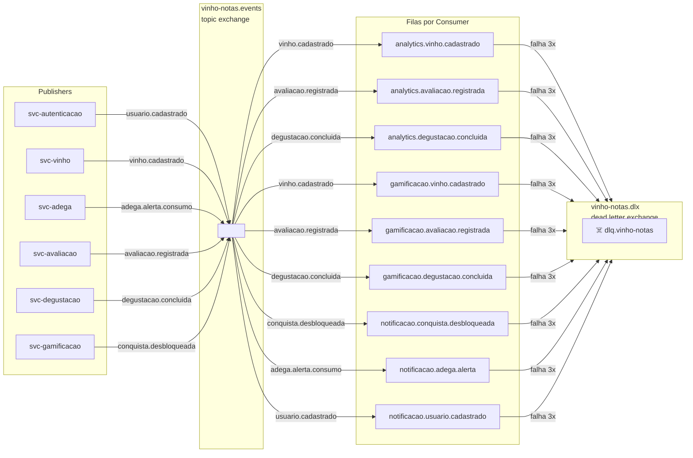

### Mapa de eventos

| Routing Key | Publisher | Consumers | Ação resultante |
|---|---|---|---|
| `usuario.cadastrado` | svc-autenticacao | svc-notificacao | E-mail de boas-vindas |
| `vinho.cadastrado` | svc-vinho | svc-analytics, svc-gamificacao | Atualiza snapshot; verifica badge |
| `vinho.excluido` | svc-vinho | svc-analytics | Remove vinho do snapshot |
| `adega.item.adicionado` | svc-adega | svc-analytics | Atualiza total da adega |
| `adega.alerta.consumo` | svc-adega | svc-notificacao | Notifica ponto de consumo ideal |
| `avaliacao.registrada` | svc-avaliacao | svc-analytics, svc-gamificacao | Atualiza stats; verifica badge |
| `degustacao.concluida` | svc-degustacao | svc-analytics, svc-gamificacao | Atualiza stats; verifica badge |
| `conquista.desbloqueada` | svc-gamificacao | svc-notificacao | Envia push de conquista |
| `nivel.atualizado` | svc-gamificacao | svc-notificacao | Notifica avanço de nível |
| `ia.recomendacao.solicitada` | svc-analytics | svc-ia | Gera recomendações em background |

### Configuração Spring AMQP

```java
@Configuration
public class RabbitMQConfig {

    public static final String EXCHANGE = "vinho-notas.events";
    public static final String DLX      = "vinho-notas.dlx";

    @Bean TopicExchange mainExchange() {
        return ExchangeBuilder.topicExchange(EXCHANGE).durable(true).build();
    }

    // Template para todas as filas do projeto: durável + DLQ + TTL
    private Queue queueComDlq(String nome) {
        return QueueBuilder.durable(nome)
            .withArgument("x-dead-letter-exchange",    DLX)
            .withArgument("x-dead-letter-routing-key", "dlq")
            .withArgument("x-message-ttl", 86_400_000) // 24h antes de ir à DLQ
            .build();
    }

    @Bean Queue queueAnalyticsVinho() { return queueComDlq("analytics.vinho.cadastrado"); }

    @Bean Binding bindingAnalyticsVinho(Queue queueAnalyticsVinho,
                                         TopicExchange mainExchange) {
        return BindingBuilder.bind(queueAnalyticsVinho)
                             .to(mainExchange).with("vinho.cadastrado");
    }
    // ... padrão repetido para cada fila
}
```

---

## 8. Outbox Pattern — Entrega Garantida de Eventos

Garante que o evento seja publicado mesmo se o serviço reiniciar após o commit no banco
e antes de publicar no RabbitMQ.

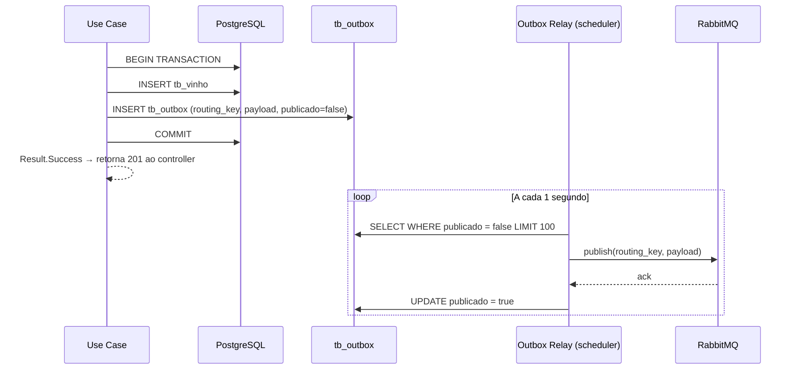

### Tabela `tb_outbox` — padrão por microsserviço

```sql
CREATE TABLE tb_outbox (
    id           UUID     PRIMARY KEY DEFAULT gen_random_uuid(),
    routing_key  VARCHAR(100) NOT NULL,
    payload      JSONB        NOT NULL,
    publicado    BOOLEAN      NOT NULL DEFAULT false,
    tentativas   INT          NOT NULL DEFAULT 0,
    publicado_em TIMESTAMP,
    created_at   TIMESTAMP    NOT NULL DEFAULT now()
);

CREATE INDEX idx_outbox_pendentes ON tb_outbox (publicado, created_at)
    WHERE publicado = false;
```

### Outbox Relay

```java
@Component
@RequiredArgsConstructor
public class OutboxRelay {

    private final OutboxRepository outboxRepository;
    private final RabbitTemplate   rabbitTemplate;

    @Scheduled(fixedDelay = 1_000)
    @Transactional
    public void processar() {
        outboxRepository.findNaoPublicados(100).forEach(evt -> {
            try {
                rabbitTemplate.convertAndSend(
                    RabbitMQConfig.EXCHANGE, evt.getRoutingKey(), evt.getPayload()
                );
                evt.marcarPublicado();
            } catch (Exception e) {
                evt.incrementarTentativas();
            }
            outboxRepository.save(evt);
        });
    }
}
```

---

## 9. Saga Pattern — Coreografia

Cada serviço conhece apenas seus próprios eventos — sem orquestrador central que seja
ponto único de falha.

### Saga 1 — Cadastro de vinho

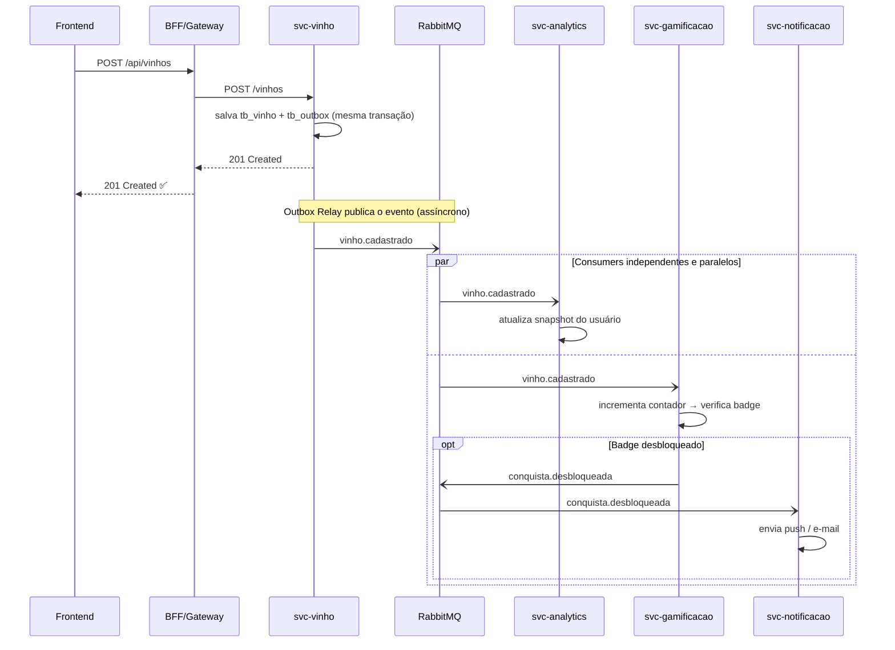

### Saga 2 — Degustação concluída

```mermaid
sequenceDiagram
    participant FE   as Frontend
    participant BFF  as BFF/Gateway
    participant DEG  as svc-degustacao
    participant MQ   as RabbitMQ
    participant ANA  as svc-analytics
    participant GAMI as svc-gamificacao
    participant NOTI as svc-notificacao

    FE   ->>  BFF: POST /api/degustacoes
    BFF  ->>  DEG: POST /degustacoes
    DEG  ->>  DEG: salva ficha + tb_outbox
    DEG  -->> BFF: 201 Created
    BFF  -->> FE:  201 Created ✅

    DEG  -)   MQ:  degustacao.concluida

    par
        MQ   -)   ANA:  degustacao.concluida
        ANA  ->>  ANA:  atualiza nota_media e total_degustacoes
    and
        MQ   -)   GAMI: degustacao.concluida
        GAMI ->>  GAMI: verifica marcos (1ª deg., 10 degs., Sommelier Amateur…)
        opt Novo nível atingido
            GAMI -)  MQ:   nivel.atualizado
            MQ   -)  NOTI: nivel.atualizado
            NOTI ->> NOTI: envia push de avanço de nível
        end
    end
```

### Saga 3 — Alerta de ponto de consumo da adega

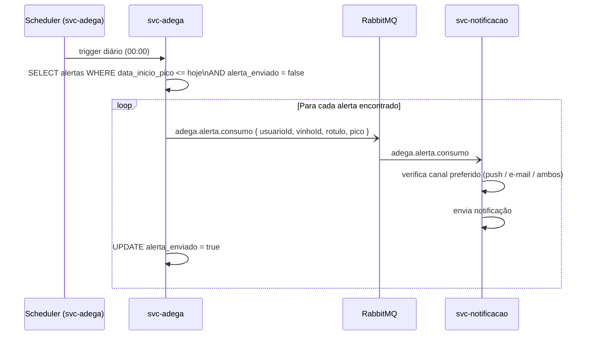

---

## 10. The Twelve-Factor App

### I — Codebase
```
Mono-repo Maven multi-módulo no GitHub.
Único codebase → múltiplos deploys (dev, homologação, produção).
Ambientes diferenciados apenas por variáveis de ambiente.
```

### II — Dependencies
```xml
Todas as dependências explícitas no pom.xml parent.
Maven Wrapper (mvnw) garante a mesma versão do Maven em todos os ambientes.
Sem dependências implícitas de sistema operacional.
```

### III — Config
```yaml
# Zero valor hard-coded de ambiente. Exemplos:
spring:
  datasource:
    url:      ${DB_URL}
    username: ${DB_USERNAME}
    password: ${DB_PASSWORD}
  rabbitmq:
    host:     ${RABBITMQ_HOST}
    username: ${RABBITMQ_USERNAME}
    password: ${RABBITMQ_PASSWORD}
jwt:
  secret:        ${JWT_SECRET}
  expiration-ms: ${JWT_EXPIRATION_MS:3600000}
spring-ai:
  openai:
    api-key: ${OPENAI_API_KEY}
```

### IV — Backing Services
```
PostgreSQL, Redis e RabbitMQ são recursos anexados.
Trocados por URL/credencial sem rebuild da aplicação.
Dev:  containers Docker locais.
Prod: serviços gerenciados (AWS RDS, ElastiCache, AmazonMQ).
A aplicação não distingue — mesmas variáveis de ambiente.
```

### V — Build, Release, Run
```
Build:   mvn package → JAR imutável
Release: docker build → imagem tagueada com SHA do commit (imutável)
Run:     docker run + variáveis de ambiente injetadas pelo ambiente

A mesma imagem sobe em dev, homologação e produção.
Nenhuma configuração embutida na imagem.
```

### VI — Processes
```
Todos os serviços são stateless.
  ● Sessão do usuário vive no JWT (payload no cliente)
  ● Cache de dashboard vive no Redis (externo e compartilhado)
  ● Contexto de chat vive no Redis com TTL de 24h
Qualquer instância pode morrer e reiniciar sem perda de estado.
```

### VII — Port Binding
```
Spring Boot com servidor embarcado (Tomcat para MVC, Netty para Gateway).
Cada serviço exporta sua porta via variável SERVER_PORT.
Sem deployment em servidor de aplicação externo.
```

### VIII — Concurrency
```yaml
# Escala horizontal: múltiplas réplicas Docker do mesmo serviço.
# Escala vertical por instância: Java 21 Virtual Threads.
spring:
  threads:
    virtual:
      enabled: true   # Uma propriedade. Cada requisição = virtual thread leve.
```

### IX — Disposability
```yaml
server:
  shutdown: graceful          # Drena requisições em andamento antes de encerrar
spring:
  lifecycle:
    timeout-per-shutdown-phase: 30s
  rabbitmq:
    listener:
      simple:
        acknowledge-mode: manual     # Mensagem confirmada só após processamento
        retry:
          enabled: true
          max-attempts: 3
          initial-interval: 1000ms
          multiplier: 2.0            # Back-off exponencial: 1s → 2s → 4s
```

### X — Dev/Prod Parity
```yaml
# docker-compose.yml — mesmos serviços de infra que rodam em produção
services:
  rabbitmq:
    image: rabbitmq:3.13-management-alpine
    ports: ["5672:5672", "15672:15672"]
  redis:
    image: redis:7.2-alpine
  postgres-vinho:
    image: postgres:16-alpine

# Spring Boot 3.3 detecta o docker-compose.yml e sobe os containers
# automaticamente em dev — sem configuração adicional no código.
```

### XI — Logs
```json
// Logback + Logstash Encoder → JSON estruturado no stdout
// traceId e spanId injetados automaticamente pelo Micrometer Tracing
{
  "timestamp":  "2025-10-15T14:32:01.123Z",
  "level":      "INFO",
  "service":    "svc-vinho",
  "traceId":    "abc123def456",
  "spanId":     "789xyz",
  "usuarioId":  "uuid-usuario",
  "message":    "Vinho cadastrado com sucesso",
  "vinhoId":    "uuid-vinho"
}
```

### XII — Admin Processes
```
Migrações de banco: Flyway executa automaticamente no startup.
  Cada serviço possui db/migration/ com scripts versionados:
    V1__create_tb_vinho.sql
    V2__create_tb_wishlist.sql
    V3__create_tb_outbox.sql

Jobs de manutenção executados como containers isolados
  usando a mesma imagem do serviço com profile Spring específico:
    docker run svc-analytics --spring.profiles.active=recalcular-snapshots
```

---

## 11. Docker — Estratégia de Containerização

### Dockerfile multi-stage por serviço

```dockerfile
# ── Stage 1: Build ──────────────────────────────────────────────
FROM maven:3.9-eclipse-temurin-21-alpine AS builder
WORKDIR /build

# Cache de dependências — rebaixa só se o pom.xml mudar
COPY pom.xml .
COPY shared-lib/pom.xml shared-lib/
RUN mvn dependency:go-offline -pl shared-lib -am

COPY . .
RUN mvn package -pl svc-vinho -am -DskipTests

# ── Stage 2: Runtime (JRE mínimo) ───────────────────────────────
FROM eclipse-temurin:21-jre-alpine AS runtime
WORKDIR /app

RUN addgroup -S appgroup && adduser -S appuser -G appgroup
USER appuser

COPY --from=builder /build/svc-vinho/target/*.jar app.jar

ENV JAVA_OPTS="-XX:+UseContainerSupport \
               -XX:MaxRAMPercentage=75.0 \
               -Djava.security.egd=file:/dev/./urandom"

EXPOSE 8083
ENTRYPOINT ["sh", "-c", "java $JAVA_OPTS -jar app.jar"]
```

### Docker Compose — ambiente de desenvolvimento completo

```yaml
version: '3.9'
services:

  # ── Bancos PostgreSQL (um por serviço) ──────────────────────────
  postgres-autenticacao:
    image: postgres:16-alpine
    environment: { POSTGRES_DB: autenticacao_db, POSTGRES_USER: app, POSTGRES_PASSWORD: app }
    ports: ["5432:5432"]

  postgres-vinho:
    image: postgres:16-alpine
    environment: { POSTGRES_DB: vinho_db, POSTGRES_USER: app, POSTGRES_PASSWORD: app }
    ports: ["5433:5432"]

  # ... (padrão repetido: porta incrementada a cada banco)

  # ── Cache ────────────────────────────────────────────────────────
  redis:
    image: redis:7.2-alpine
    ports: ["6379:6379"]
    command: redis-server --maxmemory 256mb --maxmemory-policy allkeys-lru

  # ── Mensageria ───────────────────────────────────────────────────
  rabbitmq:
    image: rabbitmq:3.13-management-alpine
    ports:
      - "5672:5672"     # AMQP
      - "15672:15672"   # Management UI → http://localhost:15672
    environment: { RABBITMQ_DEFAULT_USER: admin, RABBITMQ_DEFAULT_PASS: admin }

  # ── Microsserviços ───────────────────────────────────────────────
  bff:
    build: { context: ., dockerfile: bff/Dockerfile }
    ports: ["8080:8080"]
    environment:
      JWT_SECRET:                ${JWT_SECRET}
      SVC_AUTENTICACAO_URL:      http://svc-autenticacao:8081
      SVC_VINHO_URL:             http://svc-vinho:8083
      SPRING_DATA_REDIS_HOST:    redis
    depends_on: [redis, rabbitmq]

  svc-vinho:
    build: { context: ., dockerfile: svc-vinho/Dockerfile }
    ports: ["8083:8083"]
    environment:
      SERVER_PORT:               8083
      DB_URL:                    jdbc:postgresql://postgres-vinho:5432/vinho_db
      DB_USERNAME:               app
      DB_PASSWORD:               app
      RABBITMQ_HOST:             rabbitmq
      RABBITMQ_USERNAME:         admin
      RABBITMQ_PASSWORD:         admin
    depends_on: [postgres-vinho, rabbitmq]

  # ... (padrão repetido para cada microsserviço)
```

---

## 12. Observabilidade

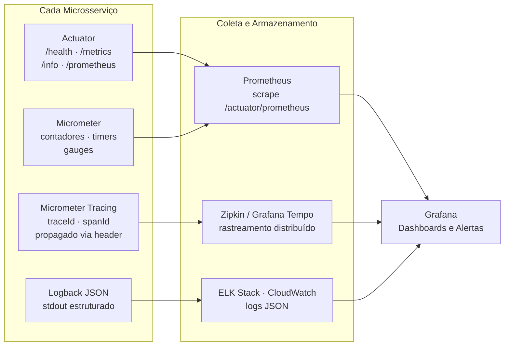

```yaml
# Configuração base — todo microsserviço
management:
  endpoints:
    web:
      exposure:
        include: health, metrics, info, prometheus
  tracing:
    sampling:
      probability: 1.0   # 100% em dev; 0.1 (10%) em produção
  metrics:
    tags:
      application: ${spring.application.name}
      environment: ${APP_ENV:dev}
```

---

## 13. Estratégia de Testes

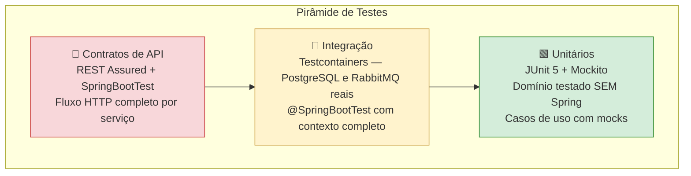

| Tipo | Ferramenta | O que testa |
|---|---|---|
| Unitário de domínio | JUnit 5 puro | Entidades + exceções — sem Spring, ultra rápido |
| Unitário de caso de uso | JUnit 5 + Mockito | Lógica de negócio com gateways mockados |
| Integração de repositório | Testcontainers + PostgreSQL | Gateway JPA com banco real |
| Integração de mensageria | Testcontainers + RabbitMQ | Publish/consume de eventos real |
| Contrato de API | REST Assured + `@SpringBootTest` | Fluxo HTTP completo do serviço |
| Mutation testing | PIT (Pitest) | Qualidade dos testes unitários (roda no CI) |

```java
// Testcontainers — sem H2, banco real nos testes
@DataJpaTest
@AutoConfigureTestDatabase(replace = NONE)
@Testcontainers
class VinhoGatewayImplTest {

    @Container
    static final PostgreSQLContainer<?> postgres =
        new PostgreSQLContainer<>("postgres:16-alpine");

    @DynamicPropertySource
    static void props(DynamicPropertyRegistry r) {
        r.add("spring.datasource.url",      postgres::getJdbcUrl);
        r.add("spring.datasource.username", postgres::getUsername);
        r.add("spring.datasource.password", postgres::getPassword);
    }

    @Autowired VinhoGatewayImpl gateway;

    @Test
    void deveSalvarERecuperarVinho() {
        var salvo = gateway.salvar(VinhoTestFactory.umVinho());
        assertThat(gateway.buscarPorId(salvo.getId())).isPresent();
    }
}
```

---

## 14. Resumo Consolidado

### Comparativo MVP v1.0 × v2.0

| Dimensão | MVP v1.0 | v2.0 |
|---|---|---|
| Java | 17 | **21** (Virtual Threads, Records, Sealed Classes) |
| Arquitetura interna | Camadas MVC | **Clean Architecture** |
| API Gateway | Não havia | **Spring Cloud Gateway** incorporado ao BFF |
| Comunicação entre serviços | HTTP síncrono | **HTTP síncrono + RabbitMQ assíncrono** |
| Padrão de coordenação | Não havia | **Saga Pattern por coreografia** |
| Entrega garantida de eventos | Não havia | **Outbox Pattern** por serviço |
| Falhas de mensagem | Não havia | **Dead Letter Queue (DLQ)** com retry exponencial |
| Resiliência no BFF | Não havia | **Resilience4j** — circuit breaker, retry, timeout |
| Configuração | Parcialmente em código | **100% variáveis de ambiente** (12-Factor III) |
| Migrações de banco | DDL auto JPA | **Flyway** versionado |
| Testes de repositório | H2 em memória | **Testcontainers + PostgreSQL real** |
| Testes de API | Não havia | **REST Assured** |
| Qualidade de testes | JaCoCo cobertura | JaCoCo + **PIT mutation testing** |
| Observabilidade | Não havia | Actuator + Micrometer + **Tracing** + Logs JSON |
| Containerização | Não havia | **Docker multi-stage + Docker Compose** |
| Build | Single module | **Maven multi-módulo** com parent POM |
| Código compartilhado | Duplicado | **shared-lib** (`Result<T>`, eventos, exceções) |

### Stack por microsserviço

| Serviço | Porta | Modelo | Banco | Extras |
|---|---|---|---|---|
| `bff` | 8080 | WebFlux (Gateway) | — | Resilience4j · Redis rate limiter |
| `svc-autenticacao` | 8081 | MVC + VThreads | PostgreSQL | Spring Security · JWT · Outbox |
| `svc-perfil` | 8082 | MVC + VThreads | PostgreSQL | — |
| `svc-vinho` | 8083 | MVC + VThreads | PostgreSQL | Outbox Pattern |
| `svc-adega` | 8084 | MVC + VThreads | PostgreSQL | Scheduler · Outbox |
| `svc-avaliacao` | 8085 | MVC + VThreads | PostgreSQL | Outbox Pattern |
| `svc-degustacao` | 8086 | MVC + VThreads | PostgreSQL + JSONB | Outbox Pattern |
| `svc-ia` | 8087 | MVC + VThreads | PostgreSQL | Spring AI · Redis context |
| `svc-gamificacao` | 8088 | MVC + VThreads | PostgreSQL | RabbitMQ consumer |
| `svc-notificacao` | 8089 | MVC + VThreads | PostgreSQL | RabbitMQ consumer · Push · E-mail |
| `svc-analytics` | 8090 | MVC + VThreads | PostgreSQL | Redis cache · RabbitMQ consumer |

---

*Vinho Notas v2.0 — Arquitetura de Backend elaborada com base no TCC de Vanderlei Kleinschmidt (2024)*
