# Vinho Notas — Arquitetura de Banco de Dados v2.0

> **Contexto:** O MVP original (2024) adotou o PostgreSQL exclusivamente, com 4 bancos isolados
> cobrindo os serviços de cadastro, vinho, avaliação e degustação. A versão 2.0 expande essa
> base para **10 microsserviços**, cada um com seu próprio banco de dados, incorporando novos
> padrões como **persistência poliglota**, **JSONB** para estruturas flexíveis e **Redis**
> como camada de cache e estado efêmero.
>
> A estratégia de isolamento do MVP é preservada e reforçada: **nenhum banco de dados possui
> chave estrangeira apontando para outro serviço**. A consistência entre serviços é garantida
> por referências de ID (UUID) e pela orquestração realizada no BFF.

---

## 1. Visão Geral — Mapa de Serviços e Bancos

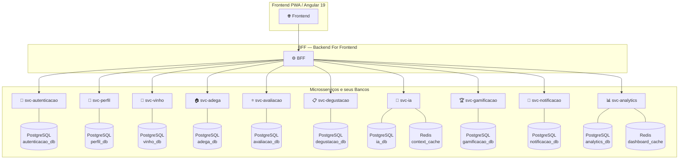

---

## 2. Decisões Arquiteturais

### 2.1 Isolamento total de bancos de dados

Cada microsserviço é o único proprietário do seu banco. Nenhuma tabela de um serviço
referencia diretamente tabelas de outro serviço por meio de chaves estrangeiras. Quando
um serviço precisa de dados de outro, ele o faz via chamada à API REST do serviço responsável,
orquestrada pelo BFF.

Essa prática garante que os serviços possam ser implantados, escalados e evoluídos de forma
completamente independente, sem acoplamento no nível de dados.

### 2.2 UUID como chave primária universal

Todos os identificadores primários utilizam o tipo `UUID v4`. Isso elimina a dependência de
sequências de banco de dados, facilita a geração de IDs no lado da aplicação e evita colisões
em cenários de replicação ou migração futura.

### 2.3 Colunas de auditoria padrão

Toda tabela que representa uma entidade de negócio deve conter as colunas:
- `created_at TIMESTAMP NOT NULL DEFAULT now()`
- `updated_at TIMESTAMP NOT NULL DEFAULT now()`
- `deleted_at TIMESTAMP` — para exclusão lógica (soft delete) onde aplicável

### 2.4 JSONB para estruturas flexíveis

O serviço de degustação utiliza colunas `JSONB` do PostgreSQL para armazenar as percepções
sensoriais da ficha formal. Essa escolha se justifica pela natureza variável dos dados:
o usuário seleciona combinações livres de termos de uma lista padronizada em cada etapa.
Criar tabelas separadas para cada combinação resultaria em um modelo excessivamente rígido
e difícil de evoluir. O JSONB preserva as propriedades ACID do PostgreSQL enquanto oferece
a flexibilidade de um documento.

### 2.5 Persistência poliglota com Redis

O Redis é adicionado em dois serviços com finalidades distintas:

| Serviço | Uso do Redis | TTL |
|---|---|---|
| `svc-ia` | Cache do contexto de conversação (histórico recente do chat por sessão) | 24 horas |
| `svc-analytics` | Cache do snapshot do dashboard (evita recalcular a cada requisição) | 1 hora |

Nos demais serviços, o PostgreSQL é suficiente. A adição do Redis é pontual e justificada
pelo perfil de acesso dos dados: efêmeros, de leitura intensiva e tolerantes à perda.

### 2.6 Comparativo com o MVP

| Dimensão | MVP v1.0 | v2.0 |
|---|---|---|
| Número de microsserviços | 5 + BFF | 10 + BFF |
| Tecnologias de banco | PostgreSQL (único) | PostgreSQL + Redis |
| Tabelas totais | ~10 | ~30 |
| Chaves primárias | SERIAL (inteiro auto-incrementado) | UUID v4 |
| Soft delete | Não implementado | `deleted_at` nas entidades principais |
| Dados flexíveis | Não | JSONB em `svc-degustacao` |
| Cache de estado | Não | Redis em `svc-ia` e `svc-analytics` |

---

## 3. Serviço de Autenticação — `svc-autenticacao`

**Banco:** `autenticacao_db` · PostgreSQL

Responsável pelo ciclo de vida de acesso ao sistema: cadastro de conta, validação de
maioridade, autenticação por e-mail/senha, vínculo com provedores OAuth (Google e Apple)
e gerenciamento de tokens JWT. É o único serviço que conhece as credenciais do usuário.
Os demais serviços recebem apenas o `usuario_id` presente no payload do JWT.

### Decisões de design

- `senha_hash` usa **bcrypt** ou **Argon2**. O campo nunca armazena a senha em texto claro.
- `tb_oauth_vinculo` permite que um mesmo usuário vincule múltiplos provedores OAuth à
  mesma conta.
- `tb_refresh_token` armazena o hash do token (não o token em si) com flag de revogação,
  permitindo logout remoto e rotação segura de tokens.

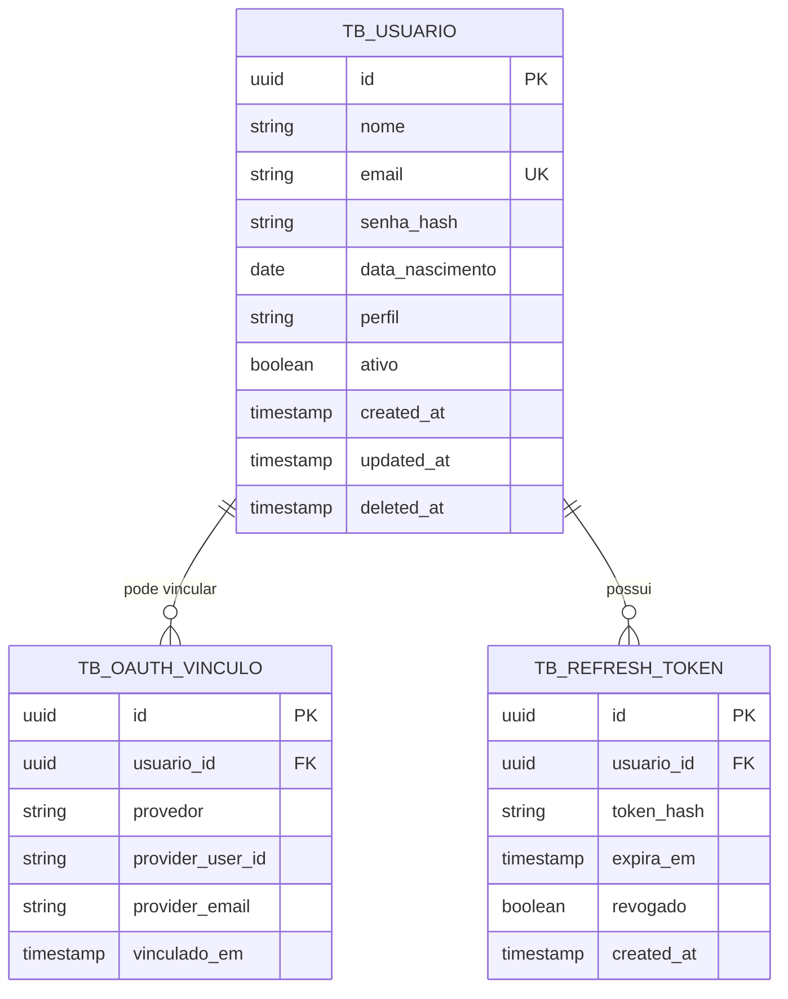

---

## 4. Serviço de Perfil — `svc-perfil`

**Banco:** `perfil_db` · PostgreSQL

Armazena os dados de apresentação e preferências do usuário: nome de exibição, foto,
sistema de pontuação preferido (estrelas ou pontos), idioma, tema visual e configurações
de notificação. É separado do `svc-autenticacao` porque possui um ciclo de vida
distinto — o perfil pode ser editado a qualquer momento sem impactar as credenciais de acesso.

### Decisões de design

- `usuario_id` é uma referência ao ID gerenciado pelo `svc-autenticacao`, mas **não é uma
  FK de banco de dados** — é um atributo de correlação.
- `sistema_pontuacao` aceita os valores `ESTRELAS` (1–5) ou `PONTOS` (0–100), conforme
  preferência configurada pelo usuário.
- `tb_configuracao_notificacao` é separada do perfil principal para permitir
  atualização granular das preferências sem tocar nos dados de identidade.

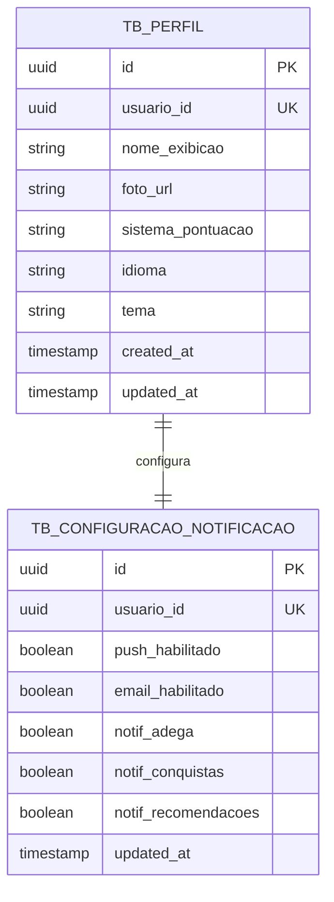

---

## 5. Serviço de Vinho — `svc-vinho`

**Banco:** `vinho_db` · PostgreSQL

Gerencia o acervo pessoal de vinhos do usuário e a sua lista de desejos (wishlist). É o
núcleo informacional da plataforma — todos os outros serviços referenciamo vinho
pelo `vinho_id`, mas nenhum armazena seus atributos.

### Decisões de design

- `codigo_barras` é populado automaticamente pelo módulo de scan de rótulo. Permite
  identificar o vinho em cadastros futuros sem redigitar os dados.
- `tb_wishlist` é uma entidade independente: pode representar um vinho que ainda não foi
  cadastrado no acervo, por isso não possui FK para `tb_vinho`. O vínculo entre wishlist
  e acervo ocorre apenas quando o usuário confirma a compra e migra o item.
- `deleted_at` em `tb_vinho` garante que avaliações e degustações associadas ao vinho
  (em outros serviços) não percam a referência histórica.

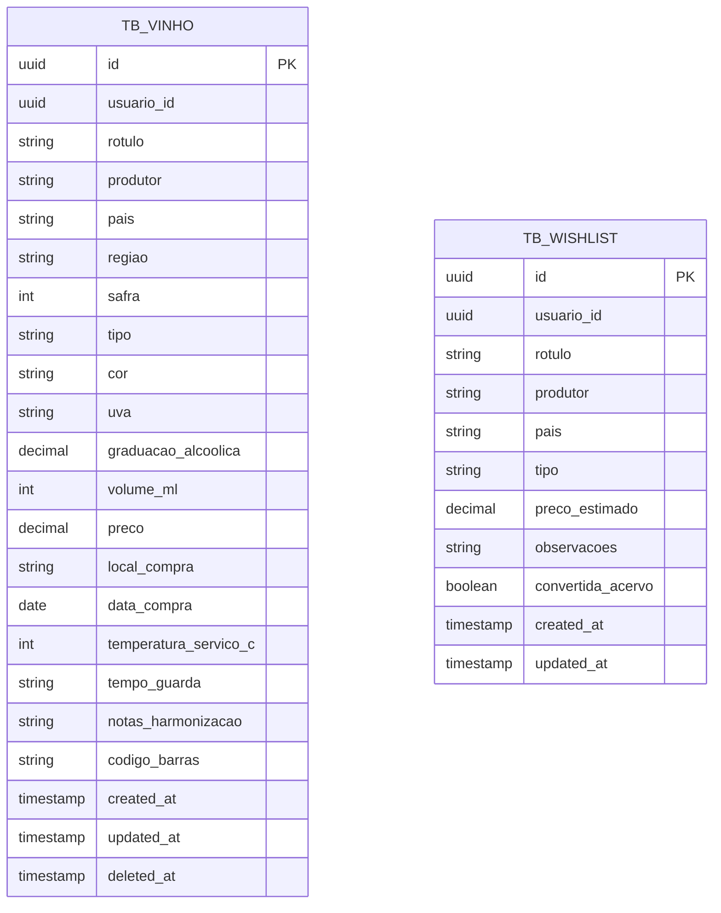

---

## 6. Serviço de Adega — `svc-adega`

**Banco:** `adega_db` · PostgreSQL

Gerencia a adega virtual: quantidade de garrafas de cada vinho, posição física na adega
e o cálculo do ponto ideal de consumo. Os alertas de consumo são gerados a partir da
combinação da safra do vinho com o tempo de guarda declarado.

### Decisões de design

- `vinho_id` referencia o vinho em `svc-vinho`, mas sem FK de banco. O serviço de adega
  consulta o `svc-vinho` via API quando precisar exibir os atributos do rótulo.
- `tb_alerta_consumo` registra o intervalo calculado de consumo ideal e controla se o
  alerta já foi enviado ao usuário — evitando notificações duplicadas.
- A posição física (`posicao_prateleira`, `posicao_coluna`) é opcional, mas permite que
  o usuário mapeie sua adega real com precisão.

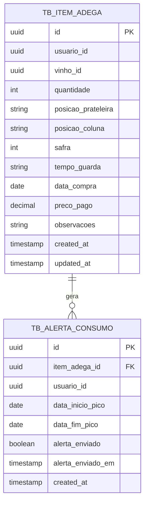

---

## 7. Serviço de Avaliação — `svc-avaliacao`

**Banco:** `avaliacao_db` · PostgreSQL

Registra as avaliações rápidas feitas pelo usuário sobre um vinho do seu acervo. Diferencia-se
da ficha de degustação por ser um registro informal e ágil, sem protocolo guiado.

### Decisões de design

- `nota` é armazenada como `DECIMAL(5,2)` para comportar tanto o sistema de estrelas
  (1.0 a 5.0) quanto o sistema de pontos (0 a 100), conforme preferência do usuário.
- `sistema_pontuacao` registra qual escala foi usada na avaliação, permitindo normalização
  nos relatórios do `svc-analytics`.
- `aspectos_visuais`, `aromas` e `sabores` são campos de texto livre — diferente da
  degustação formal, que usa listas padronizadas. Isso reflete a natureza informal
  da avaliação rápida.

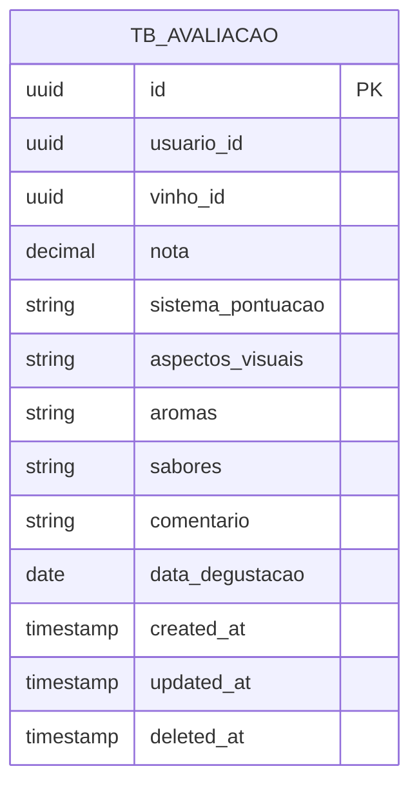

---

## 8. Serviço de Degustação — `svc-degustacao`

**Banco:** `degustacao_db` · PostgreSQL com JSONB

Gerencia as fichas de degustação formal, guiadas pelas quatro etapas clássicas da análise
sensorial. É o serviço de maior complexidade estrutural da plataforma.

### Decisões de design

- **JSONB para percepções sensoriais:** cada etapa da ficha (visual, olfativa, gustativa
  e conclusão) armazena os dados em uma coluna `JSONB`. Essa escolha se deve ao fato de
  que o usuário seleciona combinações variáveis de termos de uma lista padronizada em cada
  etapa. Uma estrutura relacional clássica exigiria tabelas de junção complexas e rígidas,
  dificultando a evolução do modelo. Com JSONB, o PostgreSQL mantém as garantias ACID
  enquanto oferece flexibilidade documental.

**Exemplo de estrutura JSONB para `percepcao_olfativa`:**
```json
{
  "intensidade": "média",
  "aromas_primarios": ["frutas vermelhas", "amora", "cereja"],
  "aromas_secundarios": ["especiarias", "pimenta"],
  "aromas_terciarios": ["cedro", "baunilha", "couro"],
  "observacoes": "Conjunto aromático complexo, com boa evolução no copo."
}
```

- `tb_item_degustacao` modela o vínculo N:N entre uma sessão e os vinhos analisados,
  suportando degustações comparativas com múltiplos rótulos.
- Cada vinho de uma sessão comparativa tem sua própria `tb_ficha_degustacao`, e o campo
  `comparacao_geral` em `tb_degustacao` registra a análise final entre os vinhos.

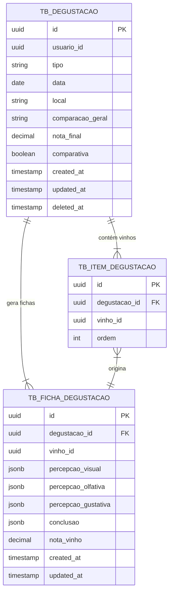

---

## 9. Serviço de IA — `svc-ia`

**Banco:** `ia_db` · PostgreSQL · **Cache:** Redis (`context_cache`)

Centraliza todas as interações com o modelo de linguagem (LLM): harmonizações,
geração de menus, chat com o sommelier virtual e recomendações personalizadas baseadas
no histórico do usuário.

### Decisões de design

- **Redis para contexto do chat:** o histórico recente de conversação (últimas N mensagens)
  é mantido no Redis com TTL de 24 horas. Isso evita consultas ao banco relacional a cada
  turno da conversa, reduzindo latência. Ao encerrar a sessão, o histórico relevante é
  persistido no PostgreSQL em `tb_historico_chat`.
- `tb_historico_chat` usa o campo `role` com os valores `user` ou `assistant`, seguindo
  o padrão de conversação da API da OpenAI / Anthropic. Isso facilita a reconstrução
  de contexto para re-envio ao LLM.
- `tb_recomendacao` registra as sugestões geradas pelo sistema para o usuário. O campo
  `adicionada_wishlist` controla se o usuário agiu sobre a recomendação.
- `tb_harmonizacao` persiste o par prompt/resposta de cada consulta de harmonização,
  permitindo exibir resultados anteriores sem rechamar a IA.
- `modo` em `tb_harmonizacao` distingue as variações: `POR_VINHO`, `POR_INGREDIENTES`
  ou `MENU_COMPLETO`.

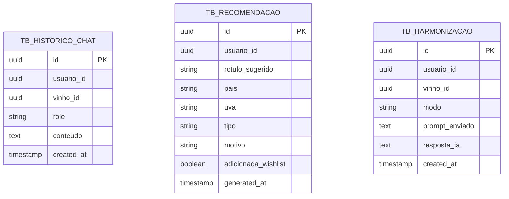

### Estrutura de chave no Redis (`context_cache`)

```
chat:context:{usuario_id}  →  JSON array com últimas 20 mensagens  (TTL: 24h)
```

---

## 10. Serviço de Gamificação — `svc-gamificacao`

**Banco:** `gamificacao_db` · PostgreSQL

Controla o sistema de progressão do usuário na plataforma: conquistas (badges) e níveis
de conhecimento enológico. É notificado pelos outros serviços via BFF a cada ação relevante
do usuário (cadastro de vinho, avaliação, degustação, etc.).

### Decisões de design

- `tb_nivel` e `tb_conquista` são **tabelas de referência** (dados mestres), populadas
  uma única vez e raramente alteradas. Contêm os critérios e descrições de cada nível e badge.
- `tb_progresso_usuario` é a entidade central: mantém o contador agregado de registros
  do usuário e o seu nível atual. É atualizada a cada evento relevante recebido pelo serviço.
- `criterio_tipo` em `tb_conquista` define o que dispara o badge: `TOTAL_VINHOS`,
  `TOTAL_AVALIACOES`, `TOTAL_DEGUSTACOES`, `PAISES_DISTINTOS`, `PRIMEIRO_CHAT_IA`, etc.
- `tb_conquista_usuario` registra o momento exato em que cada badge foi concedido —
  informação exibida no perfil e usada para gerar notificações de conquista.

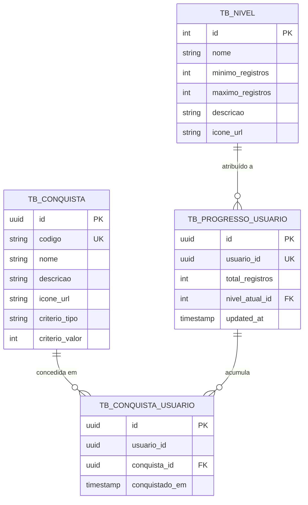

---

## 11. Serviço de Notificação — `svc-notificacao`

**Banco:** `notificacao_db` · PostgreSQL

Gerencia o ciclo de vida das notificações enviadas ao usuário: agendamento, entrega via
push (PWA Service Worker) ou e-mail, e registro do histórico de envios.

### Decisões de design

- `tipo` identifica a origem da notificação: `ALERTA_ADEGA`, `CONQUISTA`, `RECOMENDACAO`,
  `LEMBRETE_DEGUSTACAO` ou `SISTEMA`.
- `canal` aceita `PUSH`, `EMAIL` ou `AMBOS`, conforme configurado em `svc-perfil`.
- `tb_historico_notificacao` registra cada tentativa de entrega com seu `status`
  (`ENVIADA`, `FALHOU`, `CANCELADA`) e a mensagem de erro quando aplicável. Isso permite
  reprocessamento de notificações com falha.
- A geração de notificações é feita pelos próprios serviços de origem (ex.: `svc-adega`
  cria um evento de alerta de consumo) e o `svc-notificacao` é responsável apenas pela
  entrega e pelo histórico.

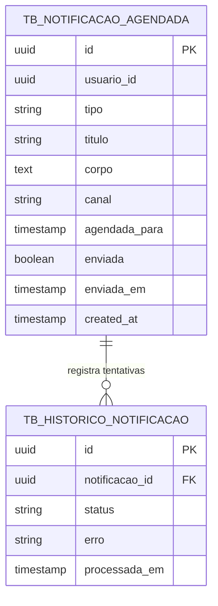

---

## 12. Serviço de Analytics — `svc-analytics`

**Banco:** `analytics_db` · PostgreSQL · **Cache:** Redis (`dashboard_cache`)

Provê os dados agregados exibidos no dashboard do usuário: estatísticas de preferências,
evolução de notas, ranking pessoal e relatório de gastos. Não possui escrita direta pelo
usuário — é alimentado de forma assíncrona a partir dos eventos dos outros serviços.

### Decisões de design

- `tb_snapshot_usuario` é um **read model**: uma tabela desnormalizada que agrega, em
  uma única linha por usuário, todas as estatísticas necessárias para o dashboard. Ela é
  recalculada pelo serviço de analytics periodicamente ou sob demanda quando novos eventos
  são recebidos.
- Os campos `distribuicao_tipos`, `distribuicao_paises`, `distribuicao_uvas` e
  `evolucao_notas` são armazenados como `JSONB`, permitindo que o frontend consuma os
  dados prontos para renderização sem cálculos adicionais.
- `tb_gasto_mensal` oferece granularidade mensal para o relatório de gastos — os valores
  são sumarizados a partir dos registros de preço em `svc-vinho` e `svc-adega`.
- **Redis como cache de dashboard:** o snapshot de cada usuário é cacheado com TTL de
  1 hora. A grande maioria dos acessos ao dashboard lê do cache; o banco PostgreSQL é
  acionado apenas para recalcular o snapshot após o TTL expirar ou quando um evento
  relevante é recebido.

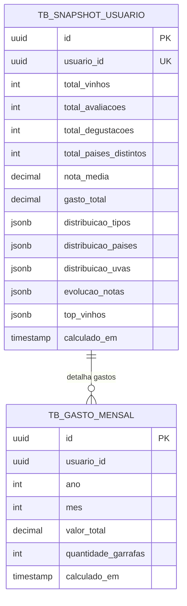

### Estrutura de chave no Redis (`dashboard_cache`)

```
dashboard:snapshot:{usuario_id}  →  JSON do snapshot completo  (TTL: 1h)
dashboard:gastos:{usuario_id}    →  JSON de gastos mensais     (TTL: 1h)
```

---

## 13. Consistência entre Serviços

Como cada serviço possui seu próprio banco isolado, não existem transações distribuídas
entre serviços. A consistência eventual é gerenciada pelo BFF e pelas seguintes práticas:

### 13.1 Referências por ID (sem FK entre serviços)

Cada serviço armazena apenas o `usuario_id` e eventuais `vinho_id` como atributos de
correlação. A resolução do objeto completo ocorre no BFF, que orquestra as chamadas
paralelas aos serviços necessários antes de compor a resposta ao frontend.

```
Exemplo — Exibir avaliação com dados do vinho:
  BFF → svc-avaliacao: GET /avaliacoes/{id}
  BFF → svc-vinho:     GET /vinhos/{vinho_id}
  BFF → compõe resposta unificada → Frontend
```

### 13.2 Exclusão lógica preserva histórico

O campo `deleted_at` garante que vinhos excluídos do acervo não quebrem avaliações e
degustações históricas referenciadas em outros serviços. O `svc-vinho` retorna os dados
do vinho mesmo após a exclusão lógica quando consultado pelo BFF para montar históricos.

### 13.3 Atualização do analytics por evento

Quando um usuário registra um novo vinho, avaliação ou degustação, o BFF notifica o
`svc-analytics` com um evento de atualização. O serviço de analytics invalida o cache
Redis do usuário e recalcula o snapshot no próximo acesso ao dashboard.

---

## 14. Resumo Consolidado

| Serviço | Banco primário | Tecnologia extra | Tabelas |
|---|---|---|---|
| `svc-autenticacao` | `autenticacao_db` | — | `tb_usuario`, `tb_oauth_vinculo`, `tb_refresh_token` |
| `svc-perfil` | `perfil_db` | — | `tb_perfil`, `tb_configuracao_notificacao` |
| `svc-vinho` | `vinho_db` | — | `tb_vinho`, `tb_wishlist` |
| `svc-adega` | `adega_db` | — | `tb_item_adega`, `tb_alerta_consumo` |
| `svc-avaliacao` | `avaliacao_db` | — | `tb_avaliacao` |
| `svc-degustacao` | `degustacao_db` | JSONB | `tb_degustacao`, `tb_item_degustacao`, `tb_ficha_degustacao` |
| `svc-ia` | `ia_db` | Redis (TTL 24h) | `tb_historico_chat`, `tb_recomendacao`, `tb_harmonizacao` |
| `svc-gamificacao` | `gamificacao_db` | — | `tb_nivel`, `tb_conquista`, `tb_progresso_usuario`, `tb_conquista_usuario` |
| `svc-notificacao` | `notificacao_db` | — | `tb_notificacao_agendada`, `tb_historico_notificacao` |
| `svc-analytics` | `analytics_db` | Redis (TTL 1h) | `tb_snapshot_usuario`, `tb_gasto_mensal` |
| **BFF** | — | — | — |
| **Total** | **10 bancos PostgreSQL** | **2 instâncias Redis** | **~27 tabelas** |

---

*Vinho Notas v2.0 — Arquitetura de Banco de Dados elaborada com base no TCC de Vanderlei Kleinschmidt (2024)*
