# Vinho Notas — Arquitetura de Frontend v2.0

> **Contexto:** O MVP original (2024) utilizou React com uma SPA monolítica e PWA habilitado.
> A versão 2.0 migra para **Angular 19** com arquitetura de **Micro Frontends** baseada em
> **Native Federation**, mantendo **SPA** e **PWA**. A aplicação é decomposta em um Shell e
> 6 MFEs alinhados aos contextos de domínio do usuário, compartilhando estado via
> **Angular Signals**, componentes via **design system próprio** e autenticação via
> interceptors JWT centralizados.

---

## 1. Visão Geral da Arquitetura

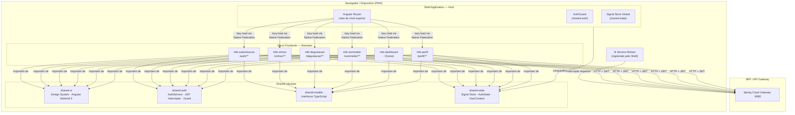

### Princípios fundamentais

- **Shell como host**: o Shell não contém lógica de negócio — é responsável por
  roteamento, autenticação e orquestração dos MFEs.
- **MFEs deployáveis de forma independente**: cada MFE tem seu próprio pipeline de
  build e pode ser atualizado sem redeploy dos demais.
- **Shared runtime controlado + libs versionadas**: dependências críticas são
  compartilhadas como singleton via Native Federation com `strictVersion`, e o
  contrato funcional permanece em bibliotecas versionadas.
- **Signals sem NgRx**: Angular Signals substituem completamente o NgRx para
  gerenciamento de estado — menos boilerplate, mais legibilidade.
- **PWA no Shell**: um único Service Worker registrado pelo Shell cobre todos os MFEs.

---

## 2. Stack Tecnológica

| Camada | Tecnologia | Versão | Justificativa |
|---|---|---|---|
| Framework | Angular | **19** | Signals GA, Standalone Components, esbuild nativo |
| Linguagem | TypeScript | **5.5+** | Strict mode obrigatório em todos os projetos |
| Micro Frontends | Native Federation | **`@angular-architects/native-federation`** | esbuild, Import Maps, sem Webpack |
| Estrutura do repo | Angular CLI multi-projeto | — | Sem ferramenta externa; `angular.json` unificado |
| Design system | Angular Material 3 | **18+** | Tokens M3, theming via CSS custom properties |
| Estilo | SCSS + CSS Custom Properties | — | Tokens de design compartilhados via `shared-ui` |
| Estado local | Angular Signals | nativo 19 | `signal()`, `computed()`, `effect()` |
| Estado global | Signal Store (`@ngrx/signals`) | **19** | Leve, baseado em Signals, sem actions/reducers |
| HTTP | Angular HttpClient | nativo | `provideHttpClient()` + interceptors funcionais |
| Roteamento | Angular Router | nativo | Lazy routes + `loadRemoteModule()` |
| Formulários | Angular Reactive Forms | nativo | Tipados com `FormGroup<T>` estrito |
| PWA | `@angular/pwa` | nativo | `ngsw-config.json` no Shell |
| Testes unitários | Jest + `jest-preset-angular` | — | Mais rápido que Karma/Jasmine |
| Testes de componente | Angular Testing Library | — | Testes orientados ao comportamento |
| Testes E2E | Cypress | **13+** | Suporte a MFEs, visual testing |
| Linting | ESLint + `angular-eslint` | — | Regras específicas para Angular |
| Formatação | Prettier | — | Configuração unificada no workspace |
| CI/CD | GitHub Actions | — | Build, test e push de imagem Docker por MFE |
| Containerização | Docker + Nginx Alpine | — | Cada MFE servido por instância Nginx independente |

---

## 3. Estrutura do Workspace

O repositório é um **Angular CLI multi-projeto** com um único `angular.json` gerenciando
todas as aplicações e bibliotecas.

```
vinho-notas-frontend/
│
├── angular.json                     ← Configuração unificada de todos os projetos
├── package.json                     ← Dependências compartilhadas
├── tsconfig.base.json               ← TypeScript base (strict: true)
├── .eslintrc.json                   ← ESLint base
│
├── projects/
│   │
│   ├── shell/                       ← Host Application (PWA + roteamento)
│   │   ├── src/
│   │   │   ├── app/
│   │   │   │   ├── app.config.ts    ← provideRouter, provideHttpClient, PWA
│   │   │   │   ├── app.routes.ts    ← rotas lazy para cada MFE
│   │   │   │   ├── layout/          ← navbar, sidebar, footer
│   │   │   │   └── shell.component.ts
│   │   │   ├── ngsw-config.json     ← Configuração do Service Worker
│   │   │   └── manifest.webmanifest
│   │   └── federation.config.ts     ← Native Federation host config
│   │
│   ├── mfe-autenticacao/            ← Login, cadastro, recuperação de senha
│   │   ├── src/app/
│   │   │   ├── login/
│   │   │   ├── cadastro/
│   │   │   └── recuperar-senha/
│   │   └── federation.config.ts     ← expõe: AuthModule routes
│   │
│   ├── mfe-vinhos/                  ← Catálogo, scan, adega, wishlist
│   │   ├── src/app/
│   │   │   ├── catalogo/
│   │   │   ├── detalhe/
│   │   │   ├── adega/
│   │   │   └── wishlist/
│   │   └── federation.config.ts
│   │
│   ├── mfe-degustacao/              ← Avaliação rápida + ficha formal
│   │   ├── src/app/
│   │   │   ├── avaliacao-rapida/
│   │   │   ├── ficha/
│   │   │   │   ├── visual/
│   │   │   │   ├── olfativa/
│   │   │   │   ├── gustativa/
│   │   │   │   └── conclusao/
│   │   │   └── historico/
│   │   └── federation.config.ts
│   │
│   ├── mfe-sommelier/               ← Chat IA, harmonização, recomendações
│   │   ├── src/app/
│   │   │   ├── chat/
│   │   │   ├── harmonizacao/
│   │   │   └── recomendacoes/
│   │   └── federation.config.ts
│   │
│   ├── mfe-dashboard/               ← Home autenticada, gráficos, insights
│   │   ├── src/app/
│   │   │   ├── resumo/
│   │   │   ├── graficos/
│   │   │   ├── ranking/
│   │   │   └── gastos/
│   │   └── federation.config.ts
│   │
│   └── mfe-perfil/                  ← Perfil, preferências, conquistas, notificações
│       ├── src/app/
│       │   ├── dados/
│       │   ├── preferencias/
│       │   ├── conquistas/
│       │   └── notificacoes/
│       └── federation.config.ts
│
└── libs/
    ├── shared-ui/                   ← Design system: componentes e tokens
    │   ├── src/
    │   │   ├── components/          ← BotaoComponent, CardComponent, etc.
    │   │   ├── tokens/              ← CSS custom properties (cores, tipografia)
    │   │   └── theme/               ← Angular Material M3 theming
    │   └── index.ts                 ← barrel export
    │
    ├── shared-auth/                 ← Autenticação transversal
    │   ├── src/
    │   │   ├── auth.service.ts
    │   │   ├── auth.guard.ts
    │   │   ├── jwt.interceptor.ts
    │   │   └── auth.models.ts
    │   └── index.ts
    │
    ├── shared-models/               ← Interfaces TypeScript de domínio
    │   ├── src/
    │   │   ├── vinho.model.ts
    │   │   ├── avaliacao.model.ts
    │   │   ├── degustacao.model.ts
    │   │   └── usuario.model.ts
    │   └── index.ts
    │
    └── shared-state/                ← Signal Store global
        ├── src/
        │   ├── auth.store.ts        ← usuário autenticado, JWT, perfil
        │   ├── ui.store.ts          ← tema, idioma, loading global
        │   └── notification.store.ts ← notificações em tempo real
        └── index.ts
```

---

## 4. Native Federation

### Por que Native Federation sobre Module Federation

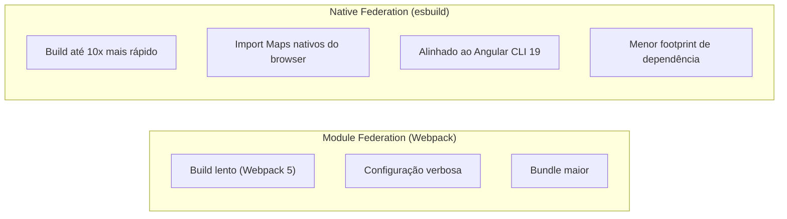

### Configuração do Shell (host)

```typescript
// projects/shell/federation.config.ts
import { withNativeFederation, shareAll } from '@angular-architects/native-federation';

export default withNativeFederation({
  name: 'shell',

  shared: {
    ...shareAll({
      singleton: true,
      strictVersion: true,
      requiredVersion: 'auto'
    })
  },

  remotes: {
    'mfe-autenticacao': 'http://localhost:4201/remoteEntry.json',
    'mfe-vinhos':       'http://localhost:4202/remoteEntry.json',
    'mfe-degustacao':   'http://localhost:4203/remoteEntry.json',
    'mfe-sommelier':    'http://localhost:4204/remoteEntry.json',
    'mfe-dashboard':    'http://localhost:4205/remoteEntry.json',
    'mfe-perfil':       'http://localhost:4206/remoteEntry.json',
  }
});
```

### Configuração de um MFE (remote) — exemplo `mfe-vinhos`

```typescript
// projects/mfe-vinhos/federation.config.ts
import { withNativeFederation, shareAll } from '@angular-architects/native-federation';

export default withNativeFederation({
  name: 'mfe-vinhos',

  exposes: {
    // Expõe as rotas do MFE para o Shell consumir
    './Routes': './projects/mfe-vinhos/src/app/vinhos.routes.ts'
  },

  shared: {
    ...shareAll({ singleton: true, strictVersion: true, requiredVersion: 'auto' })
  }
});
```

### Como o Shell carrega um MFE em runtime

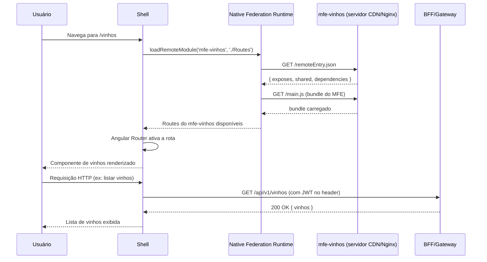

---

## 5. Roteamento

### Árvore de rotas completa

```mermaid
graph TD
    ROOT["/ (Shell Router)"]

    ROOT -->|"rota pública"| AUTH["/auth\n→ mfe-autenticacao"]
    ROOT -->|"AuthGuard"| HOME["/ (redirect)\n→ /dashboard"]
    ROOT -->|"AuthGuard"| DASH["/dashboard\n→ mfe-dashboard"]
    ROOT -->|"AuthGuard"| VINHO["/vinhos\n→ mfe-vinhos"]
    ROOT -->|"AuthGuard"| DEG["/degustacao\n→ mfe-degustacao"]
    ROOT -->|"AuthGuard"| SOM["/sommelier\n→ mfe-sommelier"]
    ROOT -->|"AuthGuard"| PERF["/perfil\n→ mfe-perfil"]

    AUTH --> A1["/auth/login"]
    AUTH --> A2["/auth/cadastro"]
    AUTH --> A3["/auth/recuperar-senha"]

    VINHO --> V1["/vinhos (lista)"]
    VINHO --> V2["/vinhos/novo"]
    VINHO --> V3["/vinhos/:id"]
    VINHO --> V4["/vinhos/adega"]
    VINHO --> V5["/vinhos/wishlist"]

    DEG --> D1["/degustacao (histórico)"]
    DEG --> D2["/degustacao/avaliacao-rapida/:vinhoId"]
    DEG --> D3["/degustacao/ficha/nova"]
    DEG --> D4["/degustacao/ficha/:id"]

    SOM --> S1["/sommelier/chat"]
    SOM --> S2["/sommelier/harmonizacao"]
    SOM --> S3["/sommelier/recomendacoes"]

    PERF --> P1["/perfil/dados"]
    PERF --> P2["/perfil/preferencias"]
    PERF --> P3["/perfil/conquistas"]
    PERF --> P4["/perfil/notificacoes"]
```

### Rotas do Shell — carregamento via Native Federation

```typescript
// projects/shell/src/app/app.routes.ts
import { Routes } from '@angular/router';
import { loadRemoteModule } from '@angular-architects/native-federation';
import { authGuard } from '@vinho-notas/shared-auth';

export const routes: Routes = [
  {
    path: 'auth',
    loadChildren: () =>
      loadRemoteModule('mfe-autenticacao', './Routes')
        .then(m => m.AUTH_ROUTES)
  },
  {
    path: 'dashboard',
    canActivate: [authGuard],
    loadChildren: () =>
      loadRemoteModule('mfe-dashboard', './Routes')
        .then(m => m.DASHBOARD_ROUTES)
  },
  {
    path: 'vinhos',
    canActivate: [authGuard],
    loadChildren: () =>
      loadRemoteModule('mfe-vinhos', './Routes')
        .then(m => m.VINHOS_ROUTES)
  },
  {
    path: 'degustacao',
    canActivate: [authGuard],
    loadChildren: () =>
      loadRemoteModule('mfe-degustacao', './Routes')
        .then(m => m.DEGUSTACAO_ROUTES)
  },
  {
    path: 'sommelier',
    canActivate: [authGuard],
    loadChildren: () =>
      loadRemoteModule('mfe-sommelier', './Routes')
        .then(m => m.SOMMELIER_ROUTES)
  },
  {
    path: 'perfil',
    canActivate: [authGuard],
    loadChildren: () =>
      loadRemoteModule('mfe-perfil', './Routes')
        .then(m => m.PERFIL_ROUTES)
  },
  { path: '',      redirectTo: 'dashboard', pathMatch: 'full' },
  { path: '**',    redirectTo: 'dashboard' }
];
```

---

## 6. Shared Libraries

### `shared-state` — Signal Store global

A biblioteca central de estado compartilhado. Usa `@ngrx/signals` como base para o
Signal Store — leve, tipado e sem actions/reducers. Todos os MFEs importam daqui;
nenhum importa estado do Shell.

```typescript
// libs/shared-state/src/auth.store.ts
import { signalStore, withState, withMethods, withComputed } from '@ngrx/signals';
import { computed, inject } from '@angular/core';

export interface AuthState {
  token:       string | null;
  usuarioId:   string | null;
  nome:        string | null;
  perfil:      'ENOFILO' | 'SOMMELIER' | 'PARCEIRO' | null;
  autenticado: boolean;
}

const initialState: AuthState = {
  token: null, usuarioId: null, nome: null, perfil: null, autenticado: false
};

export const AuthStore = signalStore(
  { providedIn: 'root' },                    // singleton em toda a aplicação
  withState(initialState),
  withComputed(({ token, perfil }) => ({
    isSommelier: computed(() => perfil() === 'SOMMELIER'),
    headerAuth:  computed(() => token() ? `Bearer ${token()}` : null),
  })),
  withMethods(store => ({
    login(token: string, payload: JwtPayload): void {
      patchState(store, {
        token,
        usuarioId:   payload.sub,
        nome:        payload.nome,
        perfil:      payload.perfil,
        autenticado: true
      });
    },
    logout(): void {
      patchState(store, initialState);
    }
  }))
);
```

```typescript
// libs/shared-state/src/ui.store.ts
export const UiStore = signalStore(
  { providedIn: 'root' },
  withState({
    tema:    'claro' as 'claro' | 'escuro',
    idioma:  'pt-BR',
    loading: false
  }),
  withMethods(store => ({
    alternarTema(): void {
      patchState(store, s => ({ tema: s.tema === 'claro' ? 'escuro' : 'claro' }));
    },
    setLoading(loading: boolean): void {
      patchState(store, { loading });
    }
  }))
);
```

### Como um MFE consome o Signal Store

```typescript
// projects/mfe-vinhos/src/app/catalogo/catalogo.component.ts
import { Component, inject, OnInit } from '@angular/core';
import { AuthStore } from '@vinho-notas/shared-state';
import { VinhoService } from '../services/vinho.service';

@Component({
  selector: 'app-catalogo',
  standalone: true,
  template: `
    <h1>Olá, {{ authStore.nome() }}</h1>

    @if (authStore.autenticado()) {
      @defer (on viewport) {
        <app-lista-vinhos [vinhos]="vinhos()" />
      } @placeholder {
        <app-skeleton />
      }
    }
  `
})
export class CatalogoComponent implements OnInit {
  protected readonly authStore  = inject(AuthStore);
  private  readonly vinhoService = inject(VinhoService);

  vinhos = signal<Vinho[]>([]);

  ngOnInit(): void {
    this.vinhoService.listar().subscribe(v => this.vinhos.set(v));
  }
}
```

### `shared-auth` — Interceptor JWT funcional

```typescript
// libs/shared-auth/src/jwt.interceptor.ts
import { HttpInterceptorFn } from '@angular/common/http';
import { inject } from '@angular/core';
import { AuthStore } from '@vinho-notas/shared-state';

// Interceptor funcional (Angular 17+ — sem classe)
export const jwtInterceptor: HttpInterceptorFn = (req, next) => {
  const authStore = inject(AuthStore);
  const token     = authStore.token();

  if (!token) return next(req);

  const authReq = req.clone({
    setHeaders: { Authorization: `Bearer ${token}` }
  });

  return next(authReq);
};
```

```typescript
// libs/shared-auth/src/auth.guard.ts
import { inject } from '@angular/core';
import { CanActivateFn, Router } from '@angular/router';
import { AuthStore } from '@vinho-notas/shared-state';

export const authGuard: CanActivateFn = () => {
  const authStore = inject(AuthStore);
  const router    = inject(Router);

  if (authStore.autenticado()) return true;

  return router.createUrlTree(['/auth/login']);
};
```

### `shared-ui` — Design System com Angular Material 3

```typescript
// libs/shared-ui/src/theme/theme.ts
import { createTheme } from '@angular/material';

// Tokens do design system do Vinho Notas
export const vinhoNotasTheme = createTheme({
  colorSchemes: {
    light: {
      primary:    '#7A1E4A',   // wine-mid
      secondary:  '#C8973A',   // gold
      tertiary:   '#4A7C8B',   // blue accent
    },
    dark: {
      primary:    '#C94F7C',
      secondary:  '#E2B96A',
      tertiary:   '#7ABCCC',
    }
  },
  typography: {
    // Playfair Display para títulos, DM Sans para corpo
  }
});
```

```scss
// libs/shared-ui/src/tokens/_tokens.scss
:root {
  --wine-dark:   #1A0610;
  --wine-mid:    #7A1E4A;
  --wine-accent: #B8335A;
  --gold:        #C8973A;
  --gold-light:  #E2B96A;

  --font-display: 'Cormorant Garamond', serif;
  --font-body:    'DM Sans', sans-serif;

  --radius-sm:   4px;
  --radius-md:   8px;
  --radius-lg:   16px;
}
```

---

## 7. Comunicação entre Micro Frontends

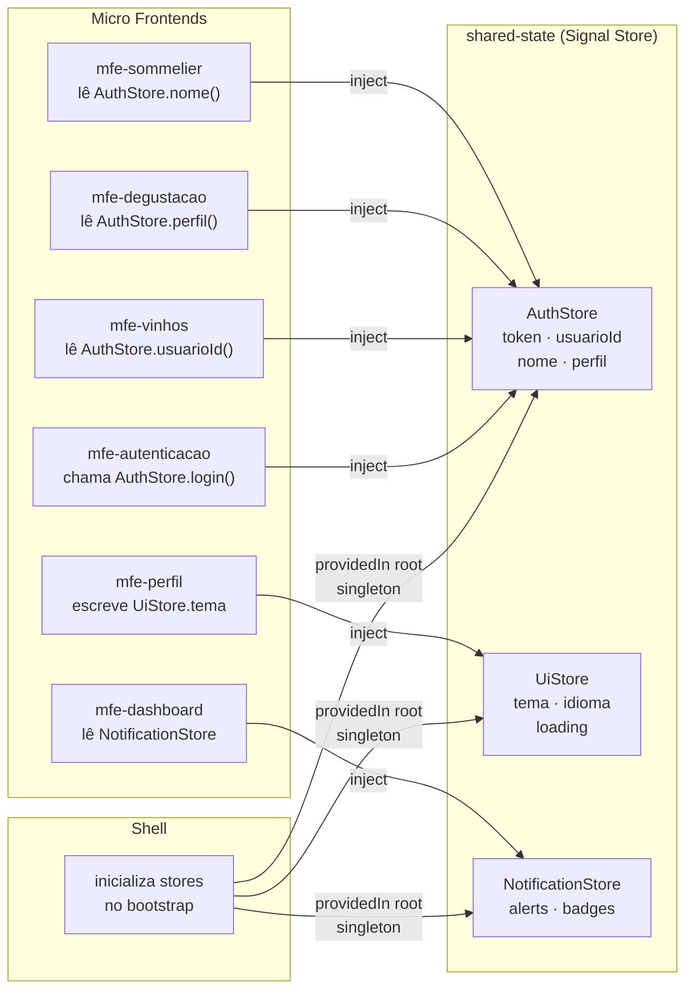

### Cenário — Login no `mfe-autenticacao` atualiza toda a aplicação

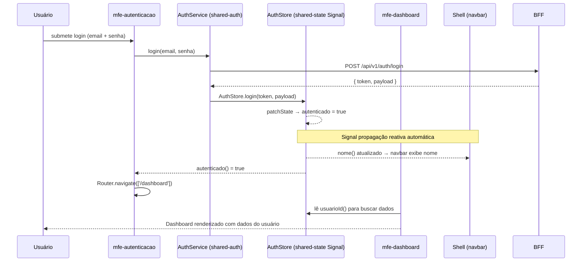

---

## 8. Fluxo de Autenticação

### Cadastro com validação de maioridade

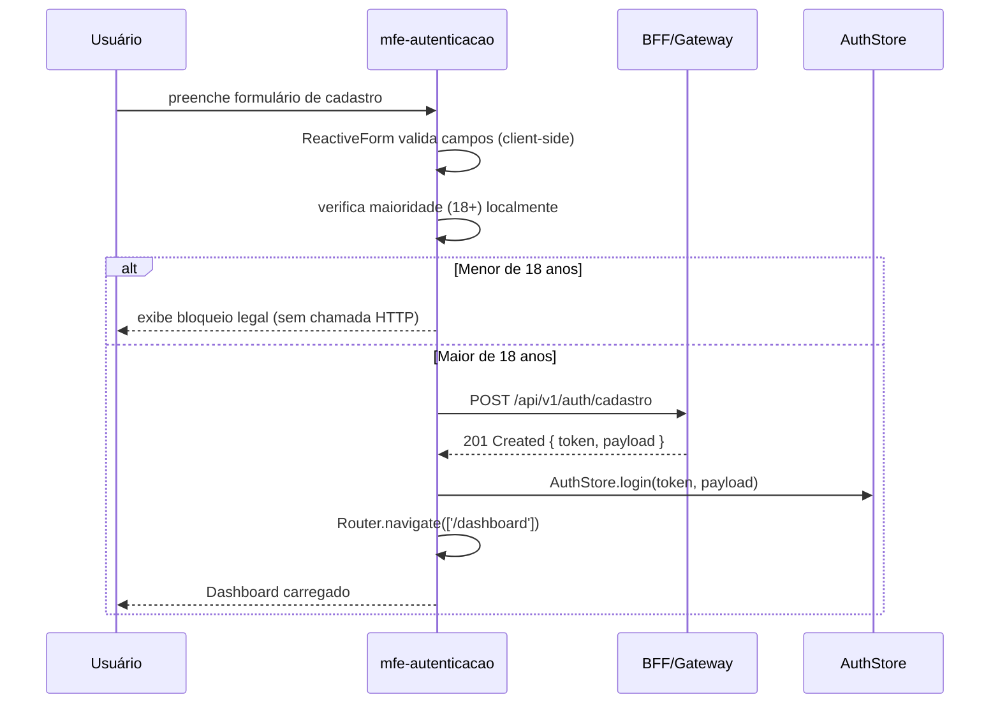

### Refresh automático do JWT

```typescript
// libs/shared-auth/src/token-refresh.interceptor.ts
export const tokenRefreshInterceptor: HttpInterceptorFn = (req, next) => {
  const authStore   = inject(AuthStore);
  const authService = inject(AuthService);
  const router      = inject(Router);

  return next(req).pipe(
    catchError(error => {
      if (error.status === 401 && !req.url.includes('/auth/')) {
        return authService.refreshToken().pipe(
          switchMap(({ token }) => {
            authStore.updateToken(token);
            return next(req.clone({
              setHeaders: { Authorization: `Bearer ${token}` }
            }));
          }),
          catchError(() => {
            authStore.logout();
            router.navigate(['/auth/login']);
            return throwError(() => error);
          })
        );
      }
      return throwError(() => error);
    })
  );
};
```

---

## 9. Standalone Components e Angular 19

Todos os componentes são **Standalone** — sem `NgModule`. Isso simplifica o tree-shaking
e torna cada componente uma unidade declarativa completa.

### Exemplo — Ficha de Degustação com `@defer` e `@for` nativos

```typescript
// projects/mfe-degustacao/src/app/ficha/ficha.component.ts
@Component({
  selector: 'app-ficha-degustacao',
  standalone: true,
  imports: [
    ReactiveFormsModule,
    MatStepperModule,
    CardComponent,           // shared-ui
    BotaoComponent,          // shared-ui
    EtapaVisualComponent,
    EtapaOlfativaComponent,
    EtapaGustativaComponent,
    EtapaConclusaoComponent
  ],
  template: `
    <mat-stepper linear>

      <mat-step label="Inspeção Visual">
        @defer (on immediate) {
          <app-etapa-visual [form]="fichaForm.controls.visual" />
        } @loading {
          <mat-spinner />
        }
      </mat-step>

      <mat-step label="Análise Olfativa">
        @defer (on idle) {
          <app-etapa-olfativa [form]="fichaForm.controls.olfativa" />
        }
      </mat-step>

      <mat-step label="Análise Gustativa">
        @defer (on idle) {
          <app-etapa-gustativa [form]="fichaForm.controls.gustativa" />
        }
      </mat-step>

      <mat-step label="Conclusão">
        <app-etapa-conclusao [form]="fichaForm.controls.conclusao" />

        @for (vinho of vinhosDaSessao(); track vinho.id) {
          <app-card-vinho [vinho]="vinho" />
        } @empty {
          <p>Nenhum vinho adicionado à sessão.</p>
        }
      </mat-step>

    </mat-stepper>
  `
})
export class FichaDegustacaoComponent {
  private readonly degustacaoService = inject(DegustacaoService);

  vinhosDaSessao = signal<Vinho[]>([]);

  fichaForm = new FormGroup({
    visual:    new FormGroup({ cor: new FormControl(''), /* ... */ }),
    olfativa:  new FormGroup({ intensidade: new FormControl(''), /* ... */ }),
    gustativa: new FormGroup({ ataque: new FormControl(''), /* ... */ }),
    conclusao: new FormGroup({ nota: new FormControl<number>(0), /* ... */ })
  });
}
```

---

## 10. PWA — Service Worker no Shell

O Service Worker é registrado **exclusivamente no Shell** e cobre todos os recursos da
aplicação, incluindo os bundles remotos carregados via Native Federation.

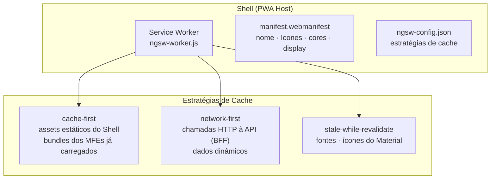

### `ngsw-config.json` — estratégias de cache

```json
{
  "index": "/index.html",
  "assetGroups": [
    {
      "name": "shell-assets",
      "installMode": "prefetch",
      "resources": {
        "files": ["/favicon.ico", "/index.html", "/manifest.webmanifest"],
        "urls": ["/*.js", "/*.css"]
      }
    },
    {
      "name": "mfe-remotes",
      "installMode": "lazy",
      "updateMode": "prefetch",
      "resources": {
        "urls": [
          "http://localhost:4201/**",
          "http://localhost:4202/**",
          "http://localhost:4203/**",
          "http://localhost:4204/**",
          "http://localhost:4205/**",
          "http://localhost:4206/**"
        ]
      }
    },
    {
      "name": "fonts",
      "installMode": "lazy",
      "updateMode": "prefetch",
      "resources": {
        "urls": ["https://fonts.googleapis.com/**", "https://fonts.gstatic.com/**"]
      }
    }
  ],
  "dataGroups": [
    {
      "name": "api-performance",
      "urls": ["/api/v1/vinhos/**", "/api/v1/dashboard/**"],
      "cacheConfig": {
        "strategy": "freshness",
        "maxSize": 100,
        "maxAge": "1h",
        "timeout": "3s"
      }
    },
    {
      "name": "api-critical",
      "urls": ["/api/v1/auth/**", "/api/v1/degustacoes/**"],
      "cacheConfig": {
        "strategy": "freshness",
        "maxSize": 50,
        "maxAge": "0s"
      }
    }
  ]
}
```

### `manifest.webmanifest`

```json
{
  "name": "Vinho Notas",
  "short_name": "VinhoNotas",
  "description": "Registre, avalie e descubra vinhos com inteligência",
  "theme_color": "#7A1E4A",
  "background_color": "#1A0610",
  "display": "standalone",
  "orientation": "portrait",
  "start_url": "/dashboard",
  "icons": [
    { "src": "icons/icon-72x72.png",   "sizes": "72x72",   "type": "image/png" },
    { "src": "icons/icon-192x192.png", "sizes": "192x192", "type": "image/png" },
    { "src": "icons/icon-512x512.png", "sizes": "512x512", "type": "image/png",
      "purpose": "maskable" }
  ]
}
```

---

## 11. Configuração do Shell (`app.config.ts`)

```typescript
// projects/shell/src/app/app.config.ts
import { ApplicationConfig, provideZonelessChangeDetection } from '@angular/core';
import { provideRouter, withPreloading, PreloadAllModules } from '@angular/router';
import { provideHttpClient, withInterceptors } from '@angular/common/http';
import { provideAnimationsAsync } from '@angular/platform-browser/animations/async';
import { provideServiceWorker } from '@angular/service-worker';
import { initFederation } from '@angular-architects/native-federation';
import { environment } from '../environments/environment';

import { routes }                from './app.routes';
import { jwtInterceptor }        from '@vinho-notas/shared-auth';
import { tokenRefreshInterceptor } from '@vinho-notas/shared-auth';
import { loadingInterceptor }    from '@vinho-notas/shared-auth';
import { vinhoNotasTheme }       from '@vinho-notas/shared-ui';
import { provideTheme }          from '@angular/material';

export const appConfig: ApplicationConfig = {
  providers: [
    // Zoneless change detection (Angular 18+) — máxima performance com Signals
    provideZonelessChangeDetection(),

    provideRouter(routes, withPreloading(PreloadAllModules)),

    provideHttpClient(
      withInterceptors([
        jwtInterceptor,           // injeta Bearer token
        tokenRefreshInterceptor,  // renova token expirado
        loadingInterceptor        // controla UiStore.loading
      ])
    ),

    provideAnimationsAsync(),

    // Angular Material 3 com tema do Vinho Notas
    provideTheme(vinhoNotasTheme),

    // PWA — Service Worker apenas em produção
    provideServiceWorker('ngsw-worker.js', {
      enabled: environment.production,
      registrationStrategy: 'registerWhenStable:30000'
    }),
  ]
};
```

---

## 12. Offline — Modo de Operação sem Conexão

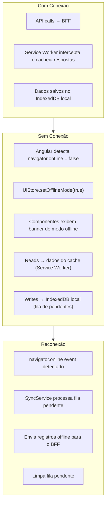

```typescript
// Detecção de conectividade no Shell
@Injectable({ providedIn: 'root' })
export class ConnectivityService {
  private readonly uiStore = inject(UiStore);

  constructor() {
    fromEvent(window, 'online').subscribe(()  =>
      this.uiStore.setOfflineMode(false)
    );
    fromEvent(window, 'offline').subscribe(() =>
      this.uiStore.setOfflineMode(true)
    );
  }
}
```

---

## 13. Estratégia de Testes

### Pirâmide de testes

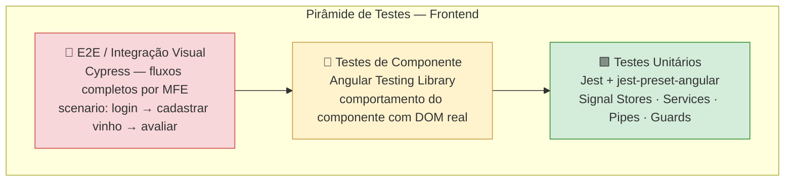

### Teste unitário de Signal Store

```typescript
// libs/shared-state/src/auth.store.spec.ts
import { TestBed } from '@angular/core/testing';
import { AuthStore } from './auth.store';

describe('AuthStore', () => {
  let store: InstanceType<typeof AuthStore>;

  beforeEach(() => {
    TestBed.configureTestingModule({});
    store = TestBed.inject(AuthStore);
  });

  it('deve iniciar não autenticado', () => {
    expect(store.autenticado()).toBe(false);
    expect(store.token()).toBeNull();
  });

  it('deve autenticar ao chamar login()', () => {
    store.login('jwt-token-mock', {
      sub: 'uuid-123', nome: 'Marina', perfil: 'ENOFILO'
    });
    expect(store.autenticado()).toBe(true);
    expect(store.nome()).toBe('Marina');
    expect(store.headerAuth()).toBe('Bearer jwt-token-mock');
  });

  it('deve limpar estado ao chamar logout()', () => {
    store.login('jwt', { sub: 'id', nome: 'X', perfil: 'ENOFILO' });
    store.logout();
    expect(store.autenticado()).toBe(false);
    expect(store.token()).toBeNull();
  });
});
```

### Teste de componente com Angular Testing Library

```typescript
// projects/mfe-vinhos/src/app/catalogo/catalogo.component.spec.ts
import { render, screen } from '@testing-library/angular';
import { CatalogoComponent } from './catalogo.component';
import { VinhoService } from '../services/vinho.service';
import { of } from 'rxjs';

describe('CatalogoComponent', () => {
  it('deve exibir lista de vinhos retornada pelo serviço', async () => {
    const vinhosMock = [
      { id: '1', rotulo: 'Barca Velha', pais: 'Portugal' },
      { id: '2', rotulo: 'Don Melchor', pais: 'Chile' }
    ];

    await render(CatalogoComponent, {
      providers: [
        { provide: VinhoService, useValue: { listar: () => of(vinhosMock) } }
      ]
    });

    expect(screen.getByText('Barca Velha')).toBeInTheDocument();
    expect(screen.getByText('Don Melchor')).toBeInTheDocument();
  });
});
```

### Teste E2E com Cypress — fluxo de cadastro de vinho

```typescript
// cypress/e2e/cadastrar-vinho.cy.ts
describe('Cadastro de vinho', () => {
  beforeEach(() => {
    cy.loginViaApi();                       // custom command — autentica via API
    cy.visit('/vinhos/novo');
  });

  it('deve cadastrar um vinho manual com sucesso', () => {
    cy.get('[data-cy=rotulo-input]').type('Château Margaux');
    cy.get('[data-cy=pais-select]').click();
    cy.get('[data-cy=option-franca]').click();
    cy.get('[data-cy=safra-input]').type('2018');
    cy.get('[data-cy=preco-input]').type('850');

    cy.get('[data-cy=salvar-btn]').click();

    cy.get('[data-cy=success-toast]')
      .should('be.visible')
      .and('contain', 'Vinho cadastrado com sucesso');

    cy.url().should('include', '/vinhos');
  });
});
```

---

## 14. Docker — Deploy Independente por MFE

Cada MFE tem seu próprio `Dockerfile` e é servido por uma instância **Nginx Alpine**
independente. Isso permite atualizar e fazer rollback de cada MFE sem impactar os demais.

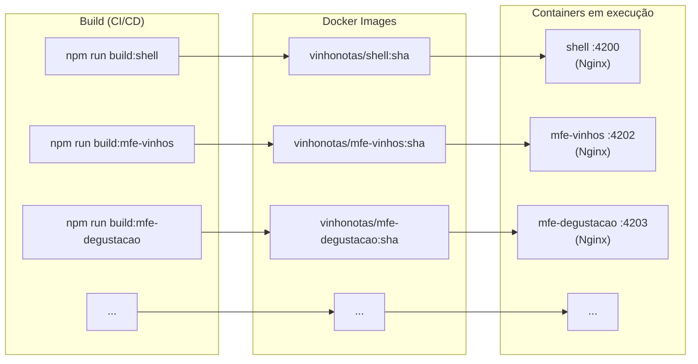

### Dockerfile por MFE (padrão multi-stage)

```dockerfile
# ── Stage 1: Build ──────────────────────────────────────────────
FROM node:22-alpine AS builder
WORKDIR /app

COPY package*.json ./
RUN npm ci --prefer-offline

COPY . .
# Cada MFE tem seu script de build independente
RUN npm run build:mfe-vinhos -- --configuration production

# ── Stage 2: Serve com Nginx ────────────────────────────────────
FROM nginx:1.27-alpine AS runtime

# Remove configuração padrão
RUN rm /etc/nginx/conf.d/default.conf
COPY nginx/mfe.conf /etc/nginx/conf.d/

COPY --from=builder /app/dist/mfe-vinhos /usr/share/nginx/html

EXPOSE 4202
CMD ["nginx", "-g", "daemon off;"]
```

### Nginx config para MFEs (SPA routing)

```nginx
# nginx/mfe.conf
server {
  listen       4202;
  root         /usr/share/nginx/html;
  index        index.html;

  # Necessário para SPA — redireciona todas as rotas para index.html
  location / {
    try_files $uri $uri/ /index.html;
  }

  # Headers de segurança
  add_header X-Frame-Options        "SAMEORIGIN";
  add_header X-Content-Type-Options "nosniff";
  add_header Referrer-Policy        "strict-origin-when-cross-origin";

  # Cache longo para assets com hash no nome
  location ~* \.(js|css|png|ico|woff2)$ {
    expires 1y;
    add_header Cache-Control "public, immutable";
  }

  # remoteEntry.json sem cache — garante carregamento da versão mais recente
  location /remoteEntry.json {
    expires -1;
    add_header Cache-Control "no-cache, no-store, must-revalidate";
  }
}
```

### Docker Compose — ambiente de desenvolvimento

```yaml
# docker-compose.frontend.yml
version: '3.9'
services:

  shell:
    build:
      context: .
      dockerfile: docker/shell.Dockerfile
    ports: ["4200:4200"]
    depends_on:
      - mfe-autenticacao
      - mfe-dashboard
      - mfe-vinhos
      - mfe-degustacao
      - mfe-sommelier
      - mfe-perfil

  mfe-autenticacao:
    build:
      context: .
      dockerfile: docker/mfe-autenticacao.Dockerfile
    ports: ["4201:4201"]

  mfe-vinhos:
    build:
      context: .
      dockerfile: docker/mfe-vinhos.Dockerfile
    ports: ["4202:4202"]

  mfe-degustacao:
    build:
      context: .
      dockerfile: docker/mfe-degustacao.Dockerfile
    ports: ["4203:4203"]

  mfe-sommelier:
    build:
      context: .
      dockerfile: docker/mfe-sommelier.Dockerfile
    ports: ["4204:4204"]

  mfe-dashboard:
    build:
      context: .
      dockerfile: docker/mfe-dashboard.Dockerfile
    ports: ["4205:4205"]

  mfe-perfil:
    build:
      context: .
      dockerfile: docker/mfe-perfil.Dockerfile
    ports: ["4206:4206"]
```

---

## 15. Pipeline CI/CD — Deploy Independente

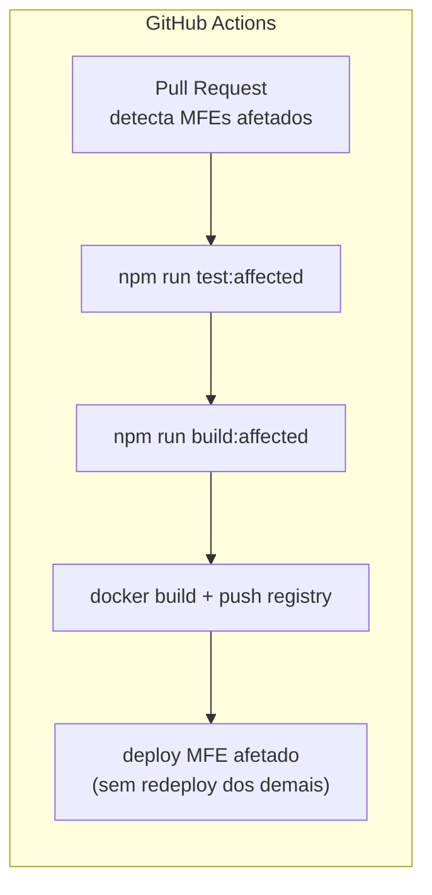

```yaml
# .github/workflows/mfe-vinhos.yml
name: CI/CD mfe-vinhos

on:
  push:
    paths:
      - 'projects/mfe-vinhos/**'
      - 'libs/shared-ui/**'
      - 'libs/shared-models/**'

jobs:
  build-and-deploy:
    runs-on: ubuntu-latest
    steps:
      - uses: actions/checkout@v4

      - name: Setup Node 22
        uses: actions/setup-node@v4
        with: { node-version: '22', cache: 'npm' }

      - run: npm ci

      - name: Lint
        run: npm run lint:mfe-vinhos

      - name: Test
        run: npm run test:mfe-vinhos -- --coverage

      - name: Build
        run: npm run build:mfe-vinhos -- --configuration production

      - name: Build Docker image
        run: |
          docker build -f docker/mfe-vinhos.Dockerfile \
            -t vinhonotas/mfe-vinhos:${{ github.sha }} .

      - name: Push to registry
        run: docker push vinhonotas/mfe-vinhos:${{ github.sha }}

      # Deploy apenas do mfe-vinhos — os demais continuam rodando
      - name: Deploy mfe-vinhos
        run: |
          # atualiza apenas o container do mfe-vinhos no ambiente
          docker service update --image \
            vinhonotas/mfe-vinhos:${{ github.sha }} mfe-vinhos
```

---

## 16. Alinhamento com The Twelve-Factor App

| Fator | Implementação no frontend |
|---|---|
| **I. Codebase** | Mono-repo Angular CLI multi-projeto no GitHub |
| **II. Dependencies** | `package.json` único com `npm ci` — sem globals implícitos |
| **III. Config** | URLs dos MFEs e do BFF por variável de ambiente no build (`environment.ts`) |
| **IV. Backing Services** | BFF tratado como serviço externo, trocável via `environment.ts` |
| **V. Build/Release/Run** | Build Angular → imagem Docker Nginx imutável → deploy por container |
| **VI. Processes** | Angular Signals no frontend → sem estado no servidor de arquivos estáticos |
| **VII. Port Binding** | Nginx embarcado por container — cada MFE exporta sua própria porta |
| **VIII. Concurrency** | Escala horizontal de containers Nginx por MFE |
| **IX. Disposability** | Nginx stateless — reinício instantâneo sem perda de estado |
| **X. Dev/Prod Parity** | Docker Compose em dev sobe os mesmos containers Nginx de produção |
| **XI. Logs** | Nginx access log no stdout — coletado por agente externo |
| **XII. Admin Processes** | Scripts de geração de ícones PWA e auditoria Lighthouse como jobs separados |

---

## 17. Resumo Consolidado

### Comparativo MVP v1.0 × v2.0

| Dimensão | MVP v1.0 | v2.0 |
|---|---|---|
| Framework | React | **Angular 19** |
| Arquitetura | SPA monolítica | **Micro Frontends** (Shell + 6 MFEs) |
| Estratégia MFE | — | **Native Federation** (esbuild) |
| Estrutura do repo | Single project | **Angular CLI multi-projeto** + 4 shared libs |
| Reatividade / Estado | React Hooks | **Angular Signals + Signal Store** |
| Módulos Angular | NgModule | **Standalone Components** (sem NgModule) |
| Lazy loading | React.lazy | **`@defer`** + `loadRemoteModule()` |
| Comunicação entre MFEs | — | **Shared Signal Store** (shared-state lib) |
| Change detection | Zone.js | **Zoneless** (`provideZonelessChangeDetection`) |
| Interceptors HTTP | — | **Interceptors funcionais** JWT + refresh + loading |
| PWA / Service Worker | No único app | **No Shell** — cobre todos os MFEs |
| Design system | CSS modules / Tailwind | **shared-ui** + Angular Material 3 tokens |
| Testes unitários | Jest + RTL | **Jest + jest-preset-angular** |
| Testes de componente | React Testing Library | **Angular Testing Library** |
| Testes E2E | Não havia | **Cypress** |
| Build | CRA / Vite | **Angular CLI + esbuild** (nativo v17+) |
| Containerização | Não havia | **Nginx Alpine** por MFE |
| Deploy | Monolítico | **Deploy independente por MFE** via CI/CD |

### Mapa de MFEs, rotas e backends consumidos

| MFE | Rota principal | Portas | Contratos consumidos no BFF |
|---|---|---|---|
| `shell` | `/` | 4200 | Roteamento e bootstrap PWA |
| `mfe-autenticacao` | `/auth` | 4201 | `/api/v1/auth/*` |
| `mfe-dashboard` | `/dashboard` | 4205 | `/api/v1/dashboard/*` |
| `mfe-vinhos` | `/vinhos` | 4202 | `/api/v1/vinhos/*`, `/api/v1/adega/*` |
| `mfe-degustacao` | `/degustacao` | 4203 | `/api/v1/avaliacoes/*`, `/api/v1/degustacoes/*` |
| `mfe-sommelier` | `/sommelier` | 4204 | `/api/v1/sommelier/*` |
| `mfe-perfil` | `/perfil` | 4206 | `/api/v1/perfil/*`, `/api/v1/notificacoes/*`, `/api/v1/progresso/*` |

---

*Vinho Notas v2.0 — Arquitetura de Frontend elaborada com base no TCC de Vanderlei Kleinschmidt (2024)*
