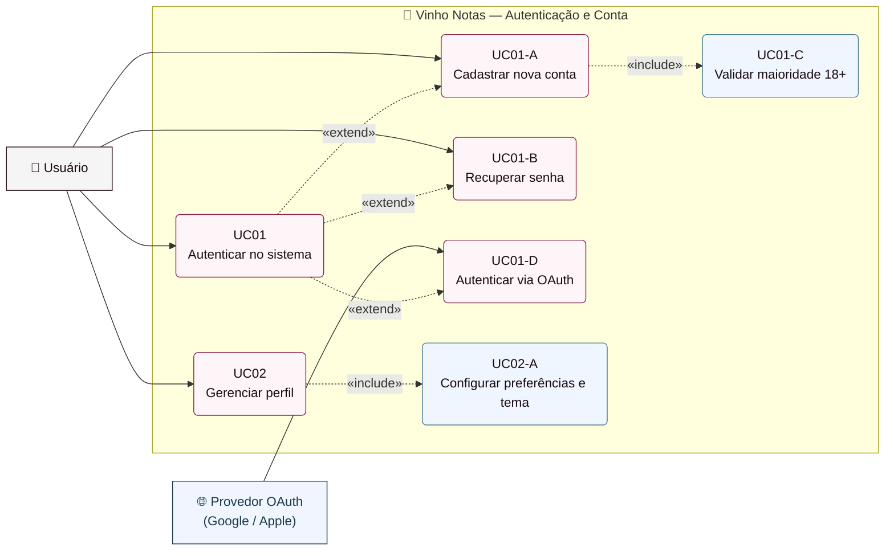
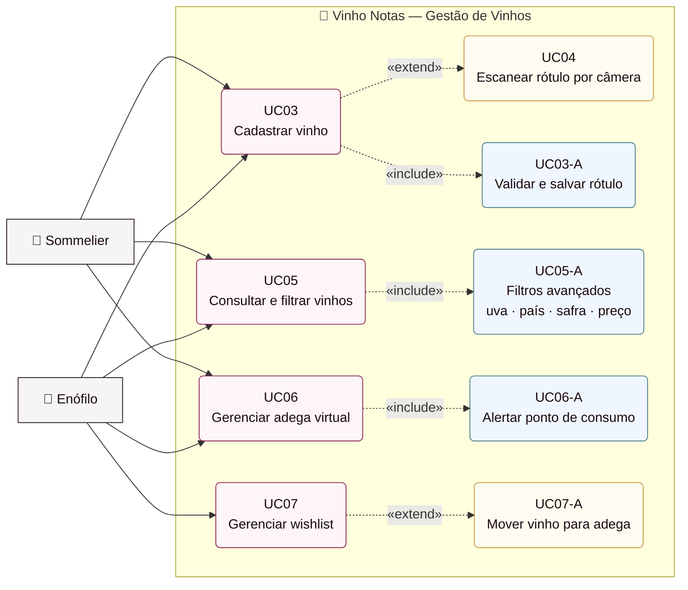
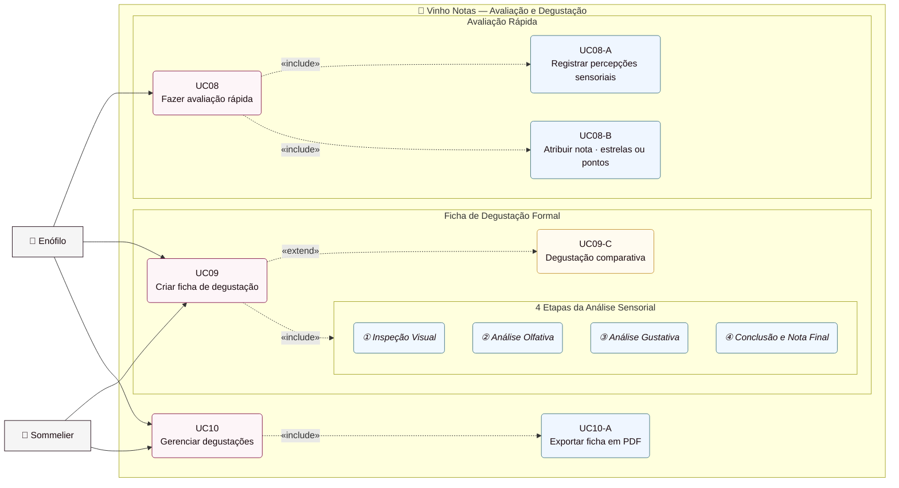
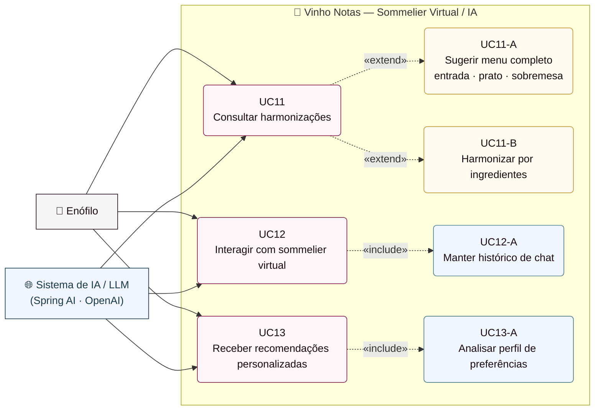
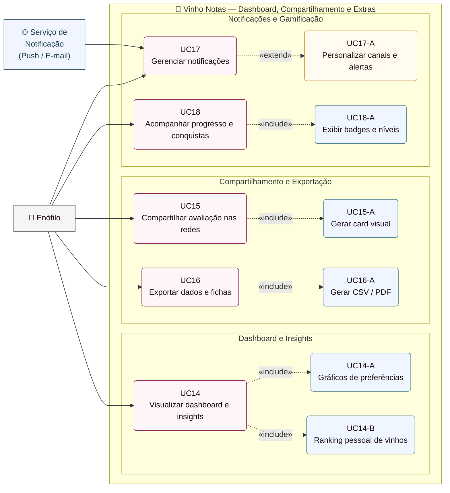

# Vinho Notas — Diagramas de Casos de Uso v2.0

> **Convenções UML adotadas**
> - `👤 Ator` → ator do sistema (fora do boundary)
> - `🌐 Ator Externo` → sistema ou serviço externo
> - `( )` nós arredondados → casos de uso
> - `-->` linha sólida → associação ator ↔ caso de uso
> - `-. «include» .->` seta tracejada → comportamento **obrigatório** incluído
> - `-. «extend» .->` seta tracejada → comportamento **opcional/condicional**
> - `subgraph` → boundary do sistema

---

## UC-01 — Autenticação e Gestão de Conta

Cobre os casos de uso relacionados ao acesso ao sistema, cadastro de usuários e gerenciamento de perfil. Inclui o fluxo de autenticação social via OAuth e a validação obrigatória de maioridade.

**Requisitos:** FR01, FR02, FR03, FR04, FR05, FR06

---

## UC-02 — Gestão de Vinhos

Abrange o ciclo completo do acervo: cadastro manual ou por escaneamento de rótulo, consulta com filtros avançados, adega virtual com alertas de ponto de consumo ideal e lista de desejos.

**Requisitos:** FR07, FR08, FR09, FR10, FR11, FR12, FR13

---

## UC-03 — Avaliação e Degustação

Contempla os dois modos de registro sensorial: a **avaliação rápida** (informal, para consumo cotidiano) e a **ficha de degustação formal**, com guia pelas 4 etapas clássicas da análise sensorial. Inclui degustações comparativas e exportação em PDF.

**Requisitos:** FR14, FR15, FR16, FR17, FR18, FR19, FR20, FR21, FR22

---

## UC-04 — Sommelier Virtual / Inteligência Artificial

Representa as interações com o módulo de IA generativa (LLM). O **Sistema de IA** é tratado como ator externo, consumido pelas funcionalidades de harmonização, geração de menu, chat e recomendações personalizadas baseadas no histórico do usuário.

**Requisitos:** FR23, FR24, FR25, FR26, FR27

---

## UC-05 — Dashboard, Compartilhamento e Extras

Agrupa os módulos transversais: painel analítico com insights de preferências, compartilhamento em redes sociais com geração de cards visuais, exportação de dados, sistema de notificações push/e-mail e programa de gamificação com níveis e conquistas.

**Requisitos:** FR28–FR40

---

## Resumo — Mapeamento Completo de Casos de Uso

| UC | Nome | Módulo | Atores | Requisitos |
|---|---|---|---|---|
| UC01 | Autenticar no sistema | Autenticação | Usuário, OAuth | FR01–FR04 |
| UC02 | Gerenciar perfil | Autenticação | Usuário | FR05–FR06 |
| UC03 | Cadastrar vinho | Vinhos | Enófilo, Sommelier | FR07–FR08 |
| UC04 | Escanear rótulo por câmera | Vinhos | Enófilo | FR08 |
| UC05 | Consultar e filtrar vinhos | Vinhos | Enófilo, Sommelier | FR09–FR10 |
| UC06 | Gerenciar adega virtual | Vinhos | Enófilo, Sommelier | FR11 |
| UC07 | Gerenciar wishlist | Vinhos | Enófilo | FR12–FR13 |
| UC08 | Fazer avaliação rápida | Degustação | Todos | FR14–FR17 |
| UC09 | Criar ficha de degustação | Degustação | Enófilo, Sommelier | FR18–FR22 |
| UC10 | Gerenciar degustações | Degustação | Enófilo, Sommelier | FR21–FR22 |
| UC11 | Consultar harmonizações | IA | Enófilo, IA/LLM | FR23–FR24 |
| UC12 | Interagir com sommelier virtual | IA | Enófilo, IA/LLM | FR25 |
| UC13 | Receber recomendações | IA | Enófilo, IA/LLM | FR26–FR27 |
| UC14 | Visualizar dashboard e insights | Dashboard | Enófilo | FR28–FR32 |
| UC15 | Compartilhar avaliação | Compartilhamento | Enófilo | FR33 |
| UC16 | Exportar dados e fichas | Compartilhamento | Enófilo, Sommelier | FR34–FR35 |
| UC17 | Gerenciar notificações | Extras | Todos | FR36–FR37 |
| UC18 | Acompanhar progresso | Extras | Todos | FR38–FR40 |

---

*Vinho Notas v2.0 — Elaborado com base no TCC de Vanderlei Kleinschmidt (2024)*
