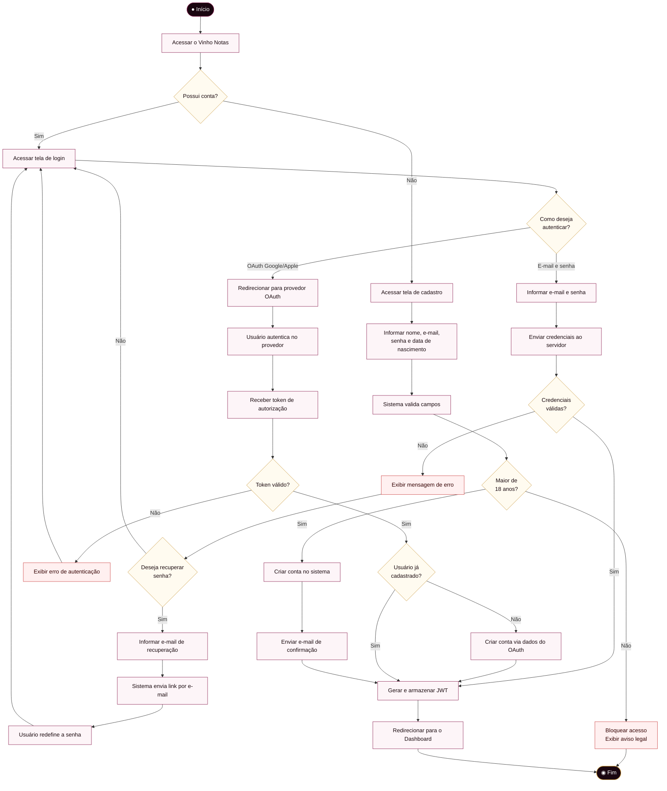
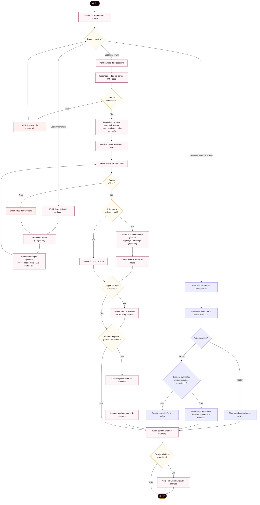
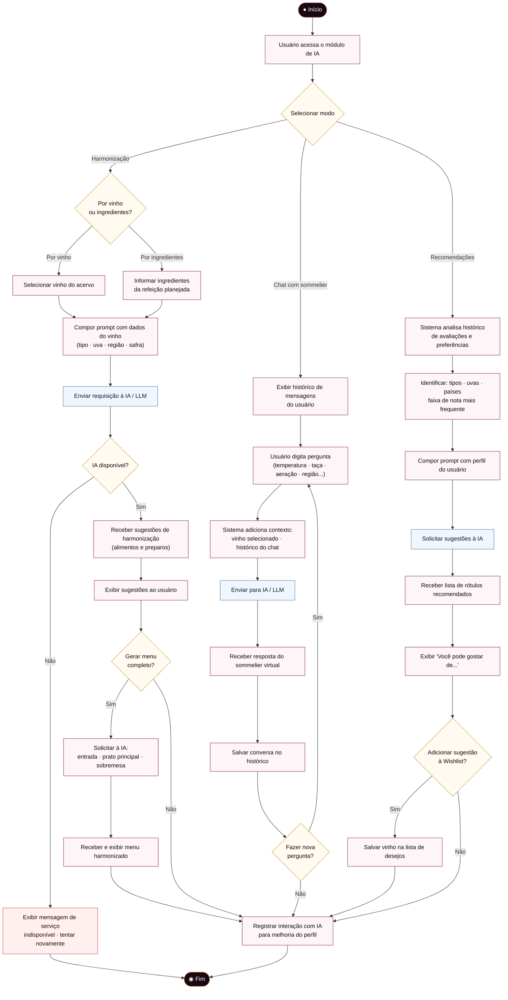
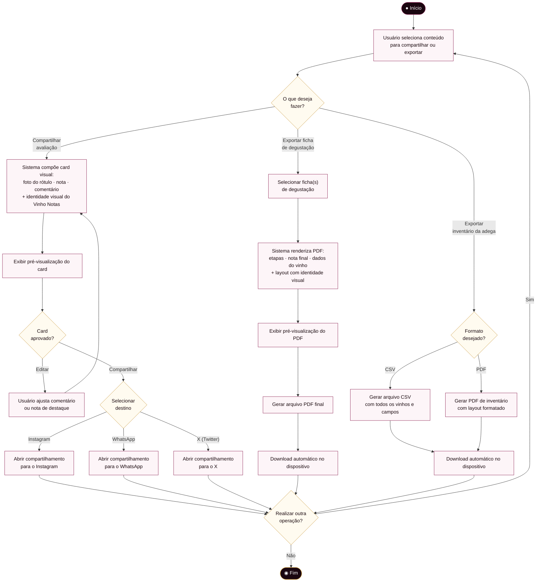
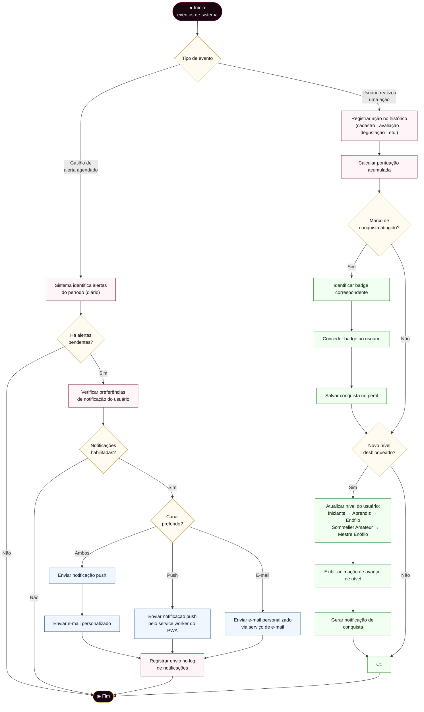

# Vinho Notas — Diagramas de Atividades v2.0
 
> **Contexto:** O TCC original (2024) apresentou um único diagrama de atividades consolidado
> cobrindo os quatro casos de uso do MVP. A versão 2.0 expande esse modelo para **8 diagramas
> individuais**, um por módulo funcional, detalhando os fluxos enriquecidos com os novos
> requisitos aprovados — OAuth, scan de rótulo, adega virtual, IA generativa, dashboard,
> compartilhamento, exportação e gamificação.
>
> **Convenções adotadas**
> - `([●])` Nó de início · `([◉])` Nó de fim
> - `[Ação]` Atividade · `{Decisão?}` Desvio condicional
> - `[[Subprocesso]]` Processo referenciado em outro diagrama
> - Setas rotuladas indicam condição da transição
> - `subgraph` delimita raias de responsabilidade (ator / sistema)
 
---
 
## AD-01 — Autenticação e Gestão de Conta
 
Cobre o fluxo completo de acesso ao sistema: primeiro acesso com cadastro e validação de
maioridade, autenticação por e-mail/senha e autenticação social via OAuth, além da recuperação
de senha. Corresponde aos requisitos **FR01–FR06**.
 

 
---
 
## AD-02 — Cadastro de Vinho e Adega Virtual
 
Detalha o fluxo de registro de um vinho no acervo pessoal, com duas entradas possíveis:
cadastro manual (formulário) ou escaneamento de rótulo pela câmera. Ao final, o usuário
pode adicionar a garrafa à adega virtual e o sistema agenda alertas de ponto de consumo ideal.
Corresponde aos requisitos **FR07–FR13, FR41**.
 

 
---
 
## AD-03 — Avaliação Rápida de Vinho
 
Representa o fluxo da avaliação informal, pensada para o momento de consumo cotidiano —
abertura de uma garrafa em casa, jantar com amigos etc. O usuário pode atribuir nota e registrar
percepções opcionais. Ao concluir, o sistema verifica se há conquistas de gamificação a liberar.
Corresponde aos requisitos **FR14–FR17**.

```mermaid
flowchart TD
    S(["● Início"])
 
    S  --> A1["Usuário acessa o acervo de vinhos"]
    A1 --> A2["Selecionar vinho para avaliar"]
    A2 --> D1{"Vinho possui\navaliação anterior?"}
 
    D1 -- "Sim" --> A3["Exibir histórico de avaliações\ndo rótulo selecionado"]
    A3 --> A4["Iniciar nova avaliação"]
    D1 -- "Não" --> A4
 
    A4  --> B1{"Registrar percepções\nsensoriais?"}
    B1  -- "Sim" --> B2["Registrar aspectos visuais\ncor · brilho · viscosidade"]
    B2  --> B3["Registrar aromas identificados\nfrutas · especiarias · madeira · floral"]
    B3  --> B4["Registrar sensações gustativas\nfinal de boca · acidez · corpo"]
    B4  --> C1
    B1  -- "Não" --> C1
 
    C1["Selecionar sistema de pontuação\n★ estrelas (1–5) ou pontos (0–100)"]
    C1  --> C2["Atribuir nota ao vinho"]
    C2  --> D2{"Adicionar\ncomentário livre?"}
    D2  -- "Sim" --> C3["Redigir comentário"]
    C3  --> D3
    D2  -- "Não" --> D3
 
    D3["Salvar avaliação com data e hora"]
    D3  --> D4["Sistema atualiza histórico do vinho"]
    D4 --> L1{"Deseja gerenciar\na lista de avaliações?"}
    L1 -- "Sim" --> L2["Abrir tela de avaliações"]
    L2 --> L3["Listar avaliações por data, nota ou rótulo"]
    L3 --> L4{"Editar ou excluir?"}
    L4 -- "Editar" --> L5["Alterar avaliação e salvar"]
    L4 -- "Excluir" --> L6["Confirmar exclusão da avaliação"]
    L5 --> E1
    L6 --> E1
    L1 -- "Não" --> E1
    D4  --> E1{"Sistema verifica\nconquistas de gamificação"}
    E1  -- "Nova conquista" --> E2["Exibir badge desbloqueado\nAtualizar nível do usuário"]
    E2  --> F1
    E1  -- "Sem novidade" --> F1
 
    F1{"Compartilhar\navaliação?"}
    F1  -- "Sim" --> G1[["AD-07 — Compartilhamento\ne Exportação"]]
    G1  --> E(["◉ Fim"])
    F1  -- "Não" --> E
 
    classDef start  fill:#1A0610,color:#fff,stroke:#7A1E4A
    classDef fim    fill:#1A0610,color:#fff,stroke:#C8973A
    classDef acao   fill:#FDF5F8,stroke:#8B2252,color:#1A0A0F
    classDef dec    fill:#FFFBF0,stroke:#C8973A,color:#1A0A0F
    classDef sub    fill:#EFF6FF,stroke:#4A7C8B,color:#0A1A2A
    classDef gami   fill:#F0FFF0,stroke:#2E8B2E,color:#0A200A
 
    class S start
    class E fim
    class A1,A2,A3,A4,B2,B3,B4,C1,C2,C3,D3,D4,L2,L3,L5,L6 acao
    class D1,B1,D2,F1,E1,L1,L4 dec
    class G1 sub
    class E2 gami
```
 

 
---
 
## AD-04 — Ficha de Degustação Formal
 
Guia o usuário pelas **4 etapas clássicas da análise sensorial**: Inspeção Visual, Análise
Olfativa, Análise Gustativa e Conclusão. Suporta degustações comparativas com múltiplos vinhos.
O resultado pode ser exportado em PDF com identidade visual da plataforma.
Corresponde aos requisitos **FR18–FR22**.

```mermaid
flowchart TD
    S(["● Início"])
 
    S  --> A1["Usuário acessa o menu Degustação"]
    A1 --> A2["Selecionar vinho para degustar"]
    A2 --> D1{"Tipo de\ndegustação?"}
 
    D1 -- "Comparativa" --> C1["Selecionar múltiplos vinhos\npara a sessão"]
    C1 --> A3
    D1 -- "Outros tipos\nvertical · horizontal\ntemática · às cegas" --> A3
 
    A3["Definir data, tipo e local (opcional)"]
    A3 --> A4["Iniciar ficha de degustação"]
 
    %% ── Etapa 1 ─────────────────────────────────────
    A4  --> E1["① INSPEÇÃO VISUAL\nAnalisar cor, intensidade,\nbrilho, turbidez e viscosidade"]
    E1  --> E1A["Selecionar termos na lista padronizada"]
    E1A --> E1B["Registrar observações visuais"]
 
    %% ── Etapa 2 ─────────────────────────────────────
    E1B --> E2["② ANÁLISE OLFATIVA\nIdentificar intensidade e aromas"]
    E2  --> E2A["Selecionar aromas:\nprimários · secundários · terciários"]
    E2A --> E2B["Registrar observações olfativas"]
 
    %% ── Etapa 3 ─────────────────────────────────────
    E2B --> E3["③ ANÁLISE GUSTATIVA\nAtaque, acidez, taninos, corpo,\nálcool, doçura e persistência"]
    E3  --> E3A["Selecionar termos na lista padronizada"]
    E3A --> E3B["Registrar observações gustativas"]
 
    %% ── Etapa 4 ─────────────────────────────────────
    E3B --> E4["④ CONCLUSÃO\nEscrever avaliação geral\ne potencial de guarda"]
    E4  --> E4A["Atribuir nota final ao vinho"]
 
    %% ── Comparativa ─────────────────────────────────
    E4A --> D2{"Degustação\ncomparativa?"}
    D2  -- "Sim" --> D3{"Há mais vinhos\na analisar?"}
    D3  -- "Sim" --> A2
    D3  -- "Não" --> F1["Registrar comparação geral\nentre os vinhos da sessão"]
    F1  --> G1
    D2  -- "Não" --> G1
 
    G1["Salvar ficha de degustação"]
    G1  --> H1{"Sistema verifica\nconquistas de gamificação"}
    G1 --> J1{"Deseja gerenciar\nfichas registradas?"}
    J1 -- "Sim" --> J2["Abrir tela de fichas"]
    J2 --> J3["Listar fichas com busca e filtros"]
    J3 --> J4{"Editar, excluir ou exportar?"}
    J4 -- "Editar" --> J5["Alterar ficha e salvar"]
    J4 -- "Excluir" --> J6["Confirmar exclusão da ficha"]
    J4 -- "Exportar" --> J7["Exportar ficha individual em PDF"]
    J5 --> H1
    J6 --> H1
    J7 --> H1
    J1 -- "Não" --> H1
    H1  -- "Nova conquista" --> H2["Exibir badge e atualizar nível"]
    H2  --> I1
    H1  -- "Sem novidade" --> I1
 
    I1{"Exportar ficha\nem PDF?"}
    I1  -- "Sim" --> I2[["AD-07 — Compartilhamento\ne Exportação"]]
    I2  --> E(["◉ Fim"])
    I1  -- "Não" --> E
 
    classDef start  fill:#1A0610,color:#fff,stroke:#7A1E4A
    classDef fim    fill:#1A0610,color:#fff,stroke:#C8973A
    classDef acao   fill:#FDF5F8,stroke:#8B2252,color:#1A0A0F
    classDef etapa  fill:#EFF6FF,stroke:#4A7C8B,color:#0A1A2A
    classDef dec    fill:#FFFBF0,stroke:#C8973A,color:#1A0A0F
    classDef sub    fill:#EFF6FF,stroke:#4A7C8B,color:#0A1A2A
    classDef gami   fill:#F0FFF0,stroke:#2E8B2E,color:#0A200A
 
    class S start
    class E fim
    class A1,A2,A3,A4,C1,G1,J2,J3,J5,J6,J7 acao
    class E1,E1A,E1B,E2,E2A,E2B,E3,E3A,E3B,E4,E4A,F1 etapa
    class D1,D2,D3,I1,H1,J1,J4 dec
    class I2 sub
    class H2 gami
```
 

 
---
 
## AD-05 — Sommelier Virtual / Inteligência Artificial
 
Detalha os três modos de interação com o módulo de IA generativa: **Harmonização** (por vinho
ou por ingredientes, com geração de menu completo), **Chat** com o sommelier virtual e
**Recomendações** personalizadas baseadas no perfil de preferências do usuário.
Corresponde aos requisitos **FR23–FR27**.
 

 
---
 
## AD-06 — Dashboard e Insights
 
Descreve o fluxo de carregamento e navegação no painel analítico pessoal. O sistema agrega
dados do acervo, avaliações e adega do usuário para gerar gráficos, rankings e alertas.
Corresponde aos requisitos **FR28–FR32, FR42**.

```mermaid
flowchart TD
    S(["● Início"])
 
    S  --> A1["Usuário acessa o Dashboard"]
    A1 --> A2["Sistema carrega dados do usuário\n(acervo · avaliações · adega · gastos)"]
    A2 --> D1{"Dados\ncarregados?"}
    D1 -- "Erro" --> A3["Exibir mensagem de erro\ncom opção de recarregar"]
    A3 --> E(["◉ Fim"])
    D1 -- "Sim" --> B1
 
    B1["Exibir resumo de atividades recentes\núltimas avaliações · últimas degustações"]
    B1 --> B2["Exibir nível de gamificação\ne conquistas recentes"]
 
    B2 --> C1["Renderizar gráfico:\ndistribuição por tipo de vinho"]
    C1 --> C2["Renderizar gráfico:\ndistribuição por país e uva"]
    C2 --> C3["Renderizar gráfico:\nevolução das notas ao longo do tempo"]
    C3 --> C4["Exibir ranking pessoal\n(Top 5 / Top 10 vinhos)"]
    C4 --> C4A{"Marcar favorito\ndo trimestre?"}
    C4A -- "Sim" --> C4B["Salvar vinho favorito\ncom referência ao período"]
    C4A -- "Não" --> D2
    C4B --> D2

    D2{"Usuário tem adega\ncom safra e tempo de guarda?"}
    D2 -- "Sim" --> D3["Calcular pontos de consumo ideal\npara cada vinho da adega"]
    D3 --> D4{"Há vinhos no\npico ou próximos?"}
    D4 -- "Sim" --> D5["Exibir alerta de ponto de consumo"]
    D5 --> E1
    D4 -- "Não" --> E1
    D2 -- "Não" --> E1
 
    E1{"Usuário registrou\npreços de compra?"}
    E1 -- "Sim" --> E2["Renderizar gráfico de gastos\npor período (mensal / anual)"]
    E2 --> F1
    E1 -- "Não" --> F1
 
    F1["Exibir painel completo ao usuário"]
    F1 --> D3A{"Usuário seleciona\nseção para detalhar?"}
    D3A -- "Sim" --> F2["Exibir detalhamento da seção\ncom filtros de período"]
    F2 --> D3A
    D3A -- "Não" --> E(["◉ Fim"])
 
    classDef start  fill:#1A0610,color:#fff,stroke:#7A1E4A
    classDef fim    fill:#1A0610,color:#fff,stroke:#C8973A
    classDef acao   fill:#FDF5F8,stroke:#8B2252,color:#1A0A0F
    classDef dec    fill:#FFFBF0,stroke:#C8973A,color:#1A0A0F
    classDef alerta fill:#FFF8E0,stroke:#C8973A,color:#3A2000
    classDef erro   fill:#FFF0F0,stroke:#CC4444,color:#330000
 
    class S start
    class E fim
    class A1,A2,B1,B2,C1,C2,C3,C4,C4B,D3,E2,F1,F2 acao
    class D1,C4A,D2,D4,E1,D3A dec
    class D5 alerta
    class A3 erro
```
 

 
---
 
## AD-07 — Compartilhamento e Exportação
 
Unifica os dois fluxos de saída de dados da plataforma: **compartilhamento** em redes sociais
com geração de card visual e **exportação** de fichas de degustação em PDF e de inventário
da adega em CSV ou PDF. Corresponde aos requisitos **FR33–FR35**.
 

 
---
 
## AD-08 — Gamificação e Notificações
 
Representa dois fluxos de sistema executados em segundo plano: o **mecanismo de gamificação**
(verificação de conquistas e avanço de nível a cada ação do usuário) e o **sistema de
notificações** (envio de alertas personalizados via push e/ou e-mail).
Corresponde aos requisitos **FR36–FR40**.
 

 
---
 
## Resumo — Cobertura dos Diagramas de Atividades
 
| Diagrama | Módulo | Requisitos cobertos | Novidades em relação ao MVP |
|---|---|---|---|
| AD-01 | Autenticação e Conta | FR01–FR06 | OAuth Google/Apple, JWT, validação de maioridade |
| AD-02 | Cadastro de Vinho e Adega | FR07–FR13, FR41 | Scan de rótulo por câmera, adega virtual, alerta de ponto de consumo e conversão wishlist→adega |
| AD-03 | Avaliação Rápida | FR14–FR17 | Listas padronizadas, dois sistemas de pontuação, integração com gamificação |
| AD-04 | Ficha de Degustação Formal | FR18–FR22 | 4 etapas guiadas, degustação comparativa, exportação PDF |
| AD-05 | Sommelier Virtual / IA | FR23–FR27 | Harmonização por ingredientes, geração de menu, chat contextual, recomendações |
| AD-06 | Dashboard e Insights | FR28–FR32, FR42 | Gráficos de preferências, ranking pessoal, favorito do trimestre, alertas de adega, relatório de gastos |
| AD-07 | Compartilhamento e Exportação | FR33–FR35 | Geração de card visual, exportação CSV/PDF, compartilhamento em redes sociais |
| AD-08 | Gamificação e Notificações | FR36–FR40 | Sistema de badges, níveis, notificações push e e-mail configuráveis |
 
---
 
*Vinho Notas v2.0 — Diagramas de Atividades elaborados com base no TCC de Vanderlei Kleinschmidt (2024)*